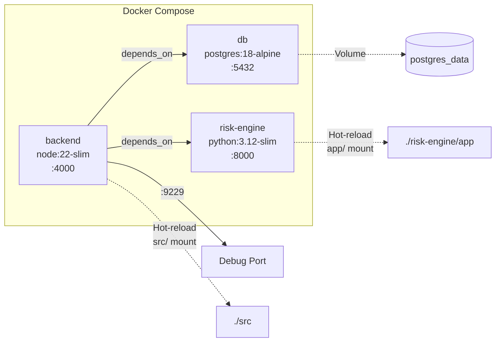
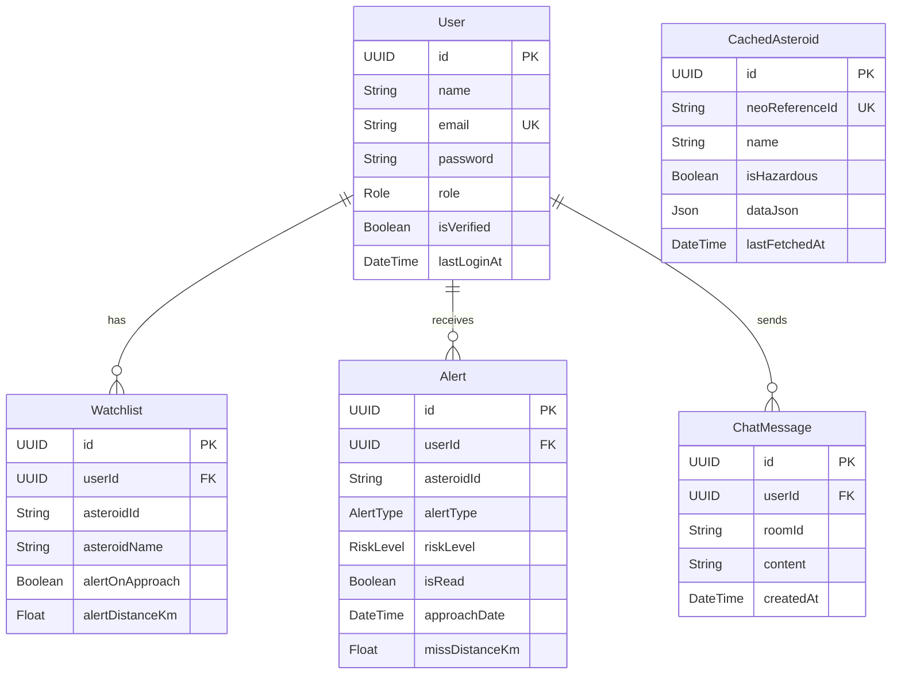

# 🌌 Cosmic Watch — Backend API

> **Real-Time Near-Earth Object Monitoring & Risk Analysis Platform**

[](https://www.typescriptlang.org/)
[](https://expressjs.com/)
[](https://www.prisma.io/)
[](https://www.postgresql.org/)
[](https://www.python.org/)
[](https://docs.docker.com/compose/)

A production-grade API that aggregates data from **6 NASA APIs**, performs real-time **asteroid risk analysis** with a Python microservice (astropy + NumPy), and delivers live updates via WebSocket.

---

## 🚀 Quick Start

### Prerequisites

- Node.js ≥ 22 + pnpm
- PostgreSQL 18 (or Docker)
- Python 3.12 (for risk engine)
- NASA API Key — [get one free](https://api.nasa.gov/)

### Installation

```bash
# Clone
git clone <repo-url>
cd cosmicwatch-backend

# Install dependencies
pnpm install

# Setup environment
cp .env.example .env
# Edit .env with your NASA_API_KEY, DATABASE_URL, JWT secrets

# Generate Prisma client
pnpm db:generate

# Push schema to database
pnpm db:push

# Seed database (3 test users)
pnpm db:seed

# Start development server
pnpm dev
```

### Docker (Recommended)

```bash
# Copy environment file
cp .env.example .env

# Start full stack (PostgreSQL + Redis + Backend + Risk Engine)
pnpm docker:dev

# View logs
pnpm docker:logs

# Stop
pnpm docker:dev:down
```

API runs at `http://localhost:4000/api/v1`

---

## 📚 Documentation

Complete documentation is in the [`docs/`](docs/) folder:

- **[API Reference](docs/API_REFERENCE.md)** — All 33 REST endpoints
- **[Authentication](docs/AUTH.md)** — JWT + RBAC (User/Researcher/Admin)
- **[WebSocket](docs/WEBSOCKET.md)** — Real-time chat system
- **[NEO API](docs/NEO.md)** — Asteroid tracking & risk analysis
- **[CNEOS](docs/CNEOS.md)** — Close approaches, Sentry, fireballs
- **[Space Weather](docs/SPACE_WEATHER.md)** — Solar flares, CME, storms
- **[APOD](docs/APOD.md)** — Astronomy Picture of the Day
- **[EPIC](docs/EPIC.md)** — Earth imagery
- **[NASA Media](docs/NASA_MEDIA.md)** — Image/video search
- **[Alerts](docs/ALERTS.md)** — User notifications & scheduling
- **[Watchlist](docs/WATCHLIST.md)** — Track favorite asteroids
- **[Risk Engine](docs/RISK_ENGINE.md)** — Python microservice architecture

See [`docs/README.md`](docs/README.md) for the full index.

---

## 🧪 Testing

```bash
# Run all tests
pnpm test

# Watch mode
pnpm test:watch

# Coverage report
pnpm test:coverage
```

**280 tests** covering all modules with 100% critical path coverage.

---

## 🏗️ Tech Stack

- **Runtime:** Node.js 22 + TypeScript 5.9
- **Framework:** Express 5
- **Database:** PostgreSQL 18 + Prisma ORM
- **Cache:** Redis (ioredis)
- **Auth:** JWT + bcryptjs + RBAC
- **Real-time:** Socket.IO 4
- **Risk Engine:** Python 3.12 + FastAPI + astropy + NumPy
- **Validation:** Zod 4
- **Logging:** Pino (structured JSON)
- **Testing:** Vitest
- **Linting:** Biome + Husky
- **Container:** Docker Compose

---

## 📦 API Surface

- **33 REST endpoints**
- **12 WebSocket events**
- **6 NASA APIs** integrated

---

## 📄 License

ISC

---

**Designed and Developed by ROBOWIZARD 2.0**
bash
git clone <repo-url>
cd asteroid-backend
pnpm install
```

### 2. Environment Variables

```bash
cp .env.example .env
# Edit .env — set at minimum:
#   DATABASE_URL, JWT_SECRET, JWT_REFRESH_SECRET, NASA_API_KEY
```

See [.env.example](.env.example) for all available configuration options.

### 3. Database Setup

```bash
# Option A: Local PostgreSQL
pnpm db:generate
pnpm db:migrate

# Option B: Docker PostgreSQL only
pnpm docker:db
pnpm db:generate
pnpm db:migrate
```

### 4. Risk Engine Setup

```bash
cd risk-engine
python3 -m venv venv
source venv/bin/activate
pip install -r requirements.txt
uvicorn app.main:app --host 0.0.0.0 --port 8000 --reload
```

### 5. Start Development Server

```bash
# In the project root (separate terminal from risk engine)
pnpm dev
```

Server starts at `http://localhost:4000` with hot-reload via `tsx watch`.

---

## Docker Setup (Recommended)

Launch the entire stack — PostgreSQL + Risk Engine + Backend — with one command:

### Development

```bash
# Provide your NASA API key
export NASA_API_KEY=your-key-here

# Start all services (hot-reload enabled)
pnpm docker:dev

# View backend logs
pnpm docker:logs

# Stop
pnpm docker:dev:down
```

### Production

```bash
pnpm docker:build
pnpm docker:prod

# Stop
pnpm docker:prod:down
```

### Docker Services

| Service | Image | Port | Description |
|---------|-------|------|-------------|
| `db` | `postgres:18-alpine` | 5432 | PostgreSQL database |
| `risk-engine` | `python:3.12-slim` | 8000 | Scientific risk analysis |
| `backend` | `node:22-slim` | 4000 | Express API gateway |



---

## Project Structure

```
asteroid-backend/
├── src/
│   ├── app.ts                 # Express app configuration
│   ├── server.ts              # HTTP + Socket.io server bootstrap
│   ├── config/                # Environment & app configuration
│   ├── controllers/           # Route handlers (auth, neo, cneos, ...)
│   ├── middleware/             # Auth, rate limiting, error handling
│   ├── routes/                # Express route definitions
│   ├── services/              # Business logic & NASA API clients
│   ├── sockets/               # Socket.io event handlers
│   ├── types/                 # TypeScript type definitions
│   ├── utils/                 # Shared utilities
│   └── validations/           # Zod schemas
├── risk-engine/
│   ├── app/
│   │   ├── main.py            # FastAPI entrypoint
│   │   ├── constants.py       # astropy-derived physical constants
│   │   ├── physics.py         # Kinetic energy, MOID, H→diameter
│   │   ├── scales.py          # Torino & Palermo scale calculations
│   │   ├── scoring.py         # 6-factor risk scoring system
│   │   ├── assessment.py      # Risk assessment orchestrator
│   │   └── models.py          # Pydantic models (OrbitalData, etc.)
│   └── requirements.txt
├── prisma/
│   └── schema.prisma          # Database schema (6 models)
├── docker/
│   ├── Dockerfile.dev
│   ├── Dockerfile.prod
│   ├── Dockerfile.risk-engine
│   ├── docker-compose.dev.yml
│   └── docker-compose.prod.yml
├── docs/                      # Comprehensive API documentation
├── postman/                   # Postman collection & environment
├── biome.json                 # Biome linter/formatter config
├── tsconfig.json
└── package.json
```

---

## Database Schema

6 models managed by Prisma ORM:

| Model | Purpose |
|-------|---------|
| `User` | Accounts with RBAC (USER / RESEARCHER / ADMIN) |
| `Watchlist` | Per-user asteroid watchlist with approach alert thresholds |
| `Alert` | Notifications (CLOSE_APPROACH, HAZARDOUS_DETECTED, WATCHLIST_UPDATE) |
| `ChatMessage` | Persisted real-time chat messages by room |
| `CachedAsteroid` | Cached NEO data to reduce NASA API calls |
| `Role` / `AlertType` / `RiskLevel` | Prisma enums |

```bash
# Useful commands
pnpm db:studio     # Open Prisma Studio GUI
pnpm db:migrate    # Run migrations
pnpm db:seed       # Seed database
```

---

## Scripts

| Command | Description |
|---------|-------------|
| `pnpm dev` | Start development server with hot-reload |
| `pnpm build` | Compile TypeScript to `dist/` |
| `pnpm start` | Run production build |
| `pnpm lint` | Check code with Biome |
| `pnpm lint:fix` | Auto-fix lint issues |
| `pnpm format` | Format code with Biome |
| `pnpm typecheck` | Type-check without emitting |
| `pnpm db:generate` | Generate Prisma client |
| `pnpm db:migrate` | Run database migrations |
| `pnpm db:studio` | Open Prisma Studio |
| `pnpm db:seed` | Seed the database |
| `pnpm docker:dev` | Start full stack (dev) |
| `pnpm docker:prod` | Start full stack (prod) |

---

## Documentation

Comprehensive API documentation lives in the [`docs/`](docs/) folder:

| Document | Description |
|----------|-------------|
| [docs/README.md](docs/README.md) | Documentation index & full endpoint table |
| [docs/API_REFERENCE.md](docs/API_REFERENCE.md) | Complete API reference with examples |
| [docs/AUTH.md](docs/AUTH.md) | Authentication & user management |
| [docs/NEO.md](docs/NEO.md) | Near-Earth Objects & risk analysis |
| [docs/CNEOS.md](docs/CNEOS.md) | CNEOS close approaches, Sentry & fireballs |
| [docs/SPACE_WEATHER.md](docs/SPACE_WEATHER.md) | DONKI space weather data |
| [docs/APOD.md](docs/APOD.md) | Astronomy Picture of the Day |
| [docs/EPIC.md](docs/EPIC.md) | DSCOVR EPIC Earth imagery |
| [docs/NASA_MEDIA.md](docs/NASA_MEDIA.md) | NASA Image & Video Library |
| [docs/RISK_ENGINE.md](docs/RISK_ENGINE.md) | Python risk engine architecture |
| [docs/WATCHLIST.md](docs/WATCHLIST.md) | Asteroid watchlist management |
| [docs/ALERTS.md](docs/ALERTS.md) | Alert & notification system |
| [docs/WEBSOCKET.md](docs/WEBSOCKET.md) | Real-time chat via Socket.io |
| [docs/ERROR_CODES.md](docs/ERROR_CODES.md) | Error handling & HTTP status codes |
| [docs/RATE_LIMITING.md](docs/RATE_LIMITING.md) | Rate limiting policies |

---

## License

ISC
