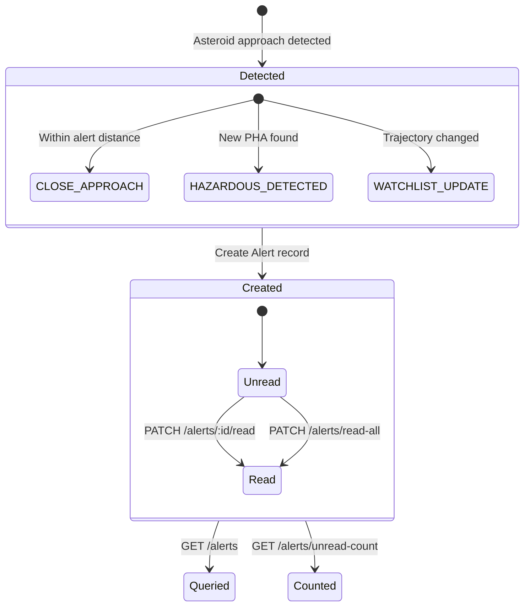
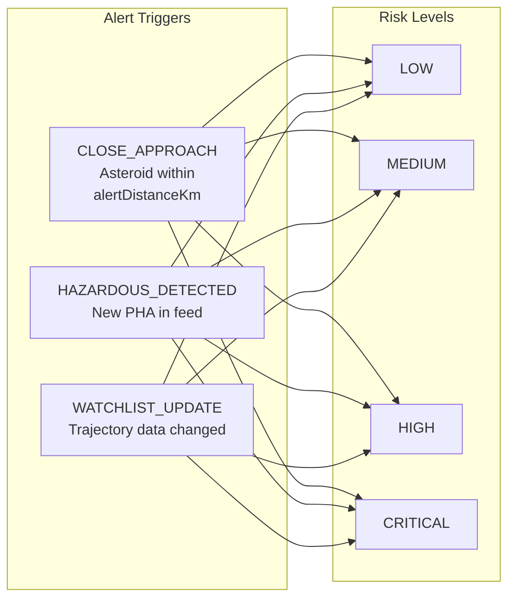

# Alerts API

> 4 endpoints — Automated notifications for close approach events

## Alert Lifecycle





## Endpoints

| # | Method | Endpoint | Auth | Rate Limit |
|---|--------|----------|------|------------|
| 1 | `GET` | `/api/v1/alerts` | Yes | Global |
| 2 | `GET` | `/api/v1/alerts/unread-count` | Yes | Global |
| 3 | `PATCH` | `/api/v1/alerts/read-all` | Yes | Global |
| 4 | `PATCH` | `/api/v1/alerts/:alertId/read` | Yes | Global |

> **All routes require authentication** — Bearer token in `Authorization` header.

---

## 1. Get Alerts

```
GET /api/v1/alerts
```

Retrieve the authenticated user's alerts with pagination and optional filtering.

### Headers

```
Authorization: Bearer <accessToken>
```

### Query Parameters

| Param | Type | Default | Description |
|-------|------|---------|-------------|
| `page` | number | `1` | Page number |
| `limit` | number | `20` | Items per page (max: 100) |
| `unread` | string | `false` | Set to `true` to only return unread alerts |

### Example Requests

```
GET /api/v1/alerts?page=1&limit=20
GET /api/v1/alerts?unread=true
GET /api/v1/alerts?page=2&limit=10&unread=true
```

### Success Response — `200 OK`

```json
{
  "success": true,
  "message": "Alerts retrieved",
  "data": [
    {
      "id": "clx...",
      "userId": "clx...",
      "asteroidId": "2465633",
      "asteroidName": "465633 (2009 JR5)",
      "alertType": "CLOSE_APPROACH",
      "message": "Asteroid 465633 (2009 JR5) will pass within 4,800,000 km of Earth",
      "riskLevel": "HIGH",
      "approachDate": "2026-02-07T00:00:00.000Z",
      "missDistanceKm": 4800000,
      "velocityKmph": 66643.2,
      "isRead": false,
      "createdAt": "2026-02-06T22:00:00.000Z"
    }
  ],
  "meta": {
    "page": 1,
    "limit": 20,
    "total": 12,
    "totalPages": 1
  }
}
```

### Sorting

Alerts are sorted by `createdAt` descending (newest first).

---

## 2. Get Unread Count

```
GET /api/v1/alerts/unread-count
```

Get the total count of unread alerts. Useful for UI badge notifications.

### Headers

```
Authorization: Bearer <accessToken>
```

### Success Response — `200 OK`

```json
{
  "success": true,
  "message": "Unread count retrieved",
  "data": {
    "count": 5
  }
}
```

---

## 3. Mark All Alerts as Read

```
PATCH /api/v1/alerts/read-all
```

Bulk-mark all of the user's unread alerts as read.

### Headers

```
Authorization: Bearer <accessToken>
```

### Success Response — `200 OK`

```json
{
  "success": true,
  "message": "All alerts marked as read",
  "data": null
}
```

---

## 4. Mark Single Alert as Read

```
PATCH /api/v1/alerts/:alertId/read
```

Mark a specific alert as read.

### Headers

```
Authorization: Bearer <accessToken>
```

### Path Parameters

| Param | Type | Description |
|-------|------|-------------|
| `alertId` | string (UUID) | Alert ID to mark as read |

### Success Response — `200 OK`

```json
{
  "success": true,
  "message": "Alert marked as read",
  "data": null
}
```

### Error Responses

| Status | Condition |
|--------|-----------|
| `401` | Missing or invalid Bearer token |

> **Note**: If `alertId` doesn't belong to the user, no rows are updated but no error is thrown (silent ownership check via `updateMany`).

---

## Alert Types

| Type | Description |
|------|-------------|
| `CLOSE_APPROACH` | Asteroid approaching within the user's configured alert distance |
| `HAZARDOUS_DETECTED` | A new potentially hazardous asteroid has been detected |
| `WATCHLIST_UPDATE` | Update on a watched asteroid's trajectory data |

## Risk Levels

| Level | Description |
|-------|-------------|
| `LOW` | Minimal concern |
| `MEDIUM` | Moderate approach parameters |
| `HIGH` | Significant threat indicators |
| `CRITICAL` | Extremely close / large / fast object |

## Database Schema

```
┌───────────────────────────────────────────────┐
│ Alert                                         │
├───────────────────────────────────────────────┤
│ id              UUID      PK, auto-gen        │
│ userId          UUID      FK → User.id         │
│ asteroidId      String    NEO reference ID     │
│ asteroidName    String    Display name         │
│ alertType       Enum      AlertType            │
│ message         String    Human-readable msg   │
│ riskLevel       Enum      RiskLevel            │
│ approachDate    DateTime  Close approach date   │
│ missDistanceKm  Float     Miss distance in km  │
│ velocityKmph    Float     Relative velocity    │
│ isRead          Boolean   Default: false       │
│ createdAt       DateTime  Auto-set             │
└───────────────────────────────────────────────┘
```
