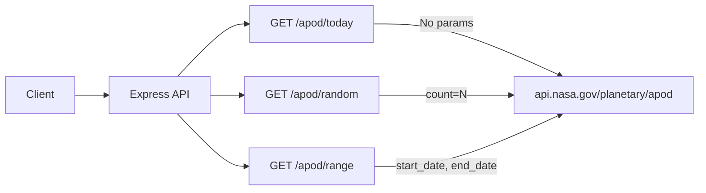

# APOD API

> Astronomy Picture of the Day

## Data Flow



## Data Source

`https://api.nasa.gov/planetary/apod` — requires NASA API key.

---

## Endpoints

### 1. `GET /api/v1/apod/today`

Get today's APOD or a specific date's picture.

**Query Parameters:**

| Parameter | Type | Default | Description |
|-----------|------|---------|-------------|
| `date` | string | today | Specific date YYYY-MM-DD |

**Response:**

```json
{
  "success": true,
  "data": {
    "title": "The Horsehead Nebula",
    "date": "2026-02-07",
    "explanation": "One of the most identifiable nebulae...",
    "mediaType": "image",
    "url": "https://apod.nasa.gov/apod/image/2602/horsehead.jpg",
    "hdUrl": "https://apod.nasa.gov/apod/image/2602/horsehead_hires.jpg",
    "thumbnailUrl": null,
    "copyright": "NASA/ESA"
  }
}
```

---

### 2. `GET /api/v1/apod/random`

Get random Astronomy Pictures of the Day.

**Query Parameters:**

| Parameter | Type | Default | Description |
|-----------|------|---------|-------------|
| `count` | number | `5` | Number of random APODs (1–10) |

**Response:** Array of APOD entries.

---

### 3. `GET /api/v1/apod/range`

Get APODs for a date range.

**Query Parameters:**

| Parameter | Type | Description |
|-----------|------|-------------|
| `start_date` | string | Start date YYYY-MM-DD (required) |
| `end_date` | string | End date YYYY-MM-DD (required) |

**Response:** Array of APOD entries for the specified range.
