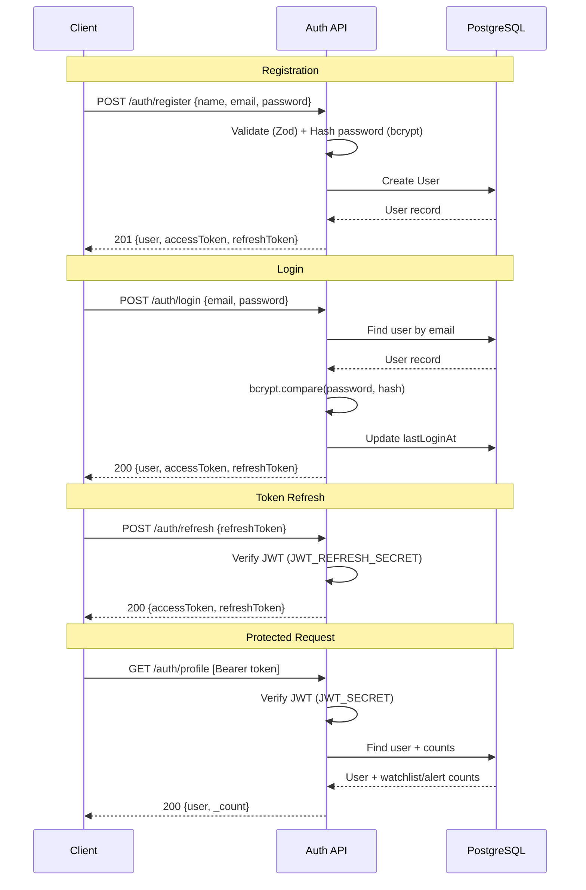

# Authentication API

> 4 endpoints — User registration, login, token refresh, and profile management

## Authentication Flow



## Endpoints

| # | Method | Endpoint | Auth | Rate Limit |
|---|--------|----------|------|------------|
| 1 | `POST` | `/api/v1/auth/register` | No | 10 req / 15 min |
| 2 | `POST` | `/api/v1/auth/login` | No | 10 req / 15 min |
| 3 | `POST` | `/api/v1/auth/refresh` | No | 10 req / 15 min |
| 4 | `GET` | `/api/v1/auth/profile` | Yes | Global |

---

## 1. Register User

```
POST /api/v1/auth/register
```

Create a new user account and receive JWT tokens.

### Request Body

| Field | Type | Required | Validation | Description |
|-------|------|----------|------------|-------------|
| `name` | string | Yes | 2–100 chars, trimmed | Display name |
| `email` | string | Yes | Valid email, lowercased | User email |
| `password` | string | Yes | Min 8 chars, 1 uppercase, 1 lowercase, 1 number | Account password |
| `role` | string | No | `USER` or `RESEARCHER` | Defaults to `USER` |

### Example Request

```json
{
  "name": "John Doe",
  "email": "john@cosmicwatch.dev",
  "password": "Cosmic123",
  "role": "USER"
}
```

### Success Response — `201 Created`

```json
{
  "success": true,
  "message": "Registration successful",
  "data": {
    "user": {
      "id": "clx...",
      "name": "John Doe",
      "email": "john@cosmicwatch.dev",
      "role": "USER",
      "createdAt": "2026-02-07T10:00:00.000Z"
    },
    "accessToken": "eyJhbGciOiJIUzI1NiIs...",
    "refreshToken": "eyJhbGciOiJIUzI1NiIs..."
  }
}
```

### Error Responses

| Status | Condition |
|--------|-----------|
| `400` | Validation failed (missing fields, weak password, etc.) |
| `409` | Email already registered |
| `429` | Rate limit exceeded (10 attempts / 15 min) |

---

## 2. Login

```
POST /api/v1/auth/login
```

Authenticate with email & password, receive JWT tokens.

### Request Body

| Field | Type | Required | Description |
|-------|------|----------|-------------|
| `email` | string | Yes | Registered email |
| `password` | string | Yes | Account password |

### Example Request

```json
{
  "email": "john@cosmicwatch.dev",
  "password": "Cosmic123"
}
```

### Success Response — `200 OK`

```json
{
  "success": true,
  "message": "Login successful",
  "data": {
    "user": {
      "id": "clx...",
      "name": "John Doe",
      "email": "john@cosmicwatch.dev",
      "role": "USER",
      "avatar": null
    },
    "accessToken": "eyJhbGciOiJIUzI1NiIs...",
    "refreshToken": "eyJhbGciOiJIUzI1NiIs..."
  }
}
```

### Error Responses

| Status | Condition |
|--------|-----------|
| `400` | Validation failed |
| `401` | Invalid email or password |
| `429` | Rate limit exceeded |

### Side Effects

- Updates `lastLoginAt` timestamp on the user record

---

## 3. Refresh Token

```
POST /api/v1/auth/refresh
```

Exchange a valid refresh token for a new access + refresh token pair.

### Request Body

| Field | Type | Required | Description |
|-------|------|----------|-------------|
| `refreshToken` | string | Yes | Valid JWT refresh token |

### Example Request

```json
{
  "refreshToken": "eyJhbGciOiJIUzI1NiIs..."
}
```

### Success Response — `200 OK`

```json
{
  "success": true,
  "message": "Token refreshed",
  "data": {
    "accessToken": "eyJhbGciOiJIUzI1NiIs...",
    "refreshToken": "eyJhbGciOiJIUzI1NiIs..."
  }
}
```

### Error Responses

| Status | Condition |
|--------|-----------|
| `401` | Invalid or expired refresh token |

---

## 4. Get Profile

```
GET /api/v1/auth/profile
```

Retrieve the authenticated user's profile with watchlist & alert counts.

### Headers

```
Authorization: Bearer <accessToken>
```

### Success Response — `200 OK`

```json
{
  "success": true,
  "message": "Success",
  "data": {
    "id": "clx...",
    "name": "John Doe",
    "email": "john@cosmicwatch.dev",
    "role": "USER",
    "avatar": null,
    "isVerified": false,
    "lastLoginAt": "2026-02-07T10:00:00.000Z",
    "createdAt": "2026-02-07T09:00:00.000Z",
    "_count": {
      "watchlist": 5,
      "alerts": 12
    }
  }
}
```

### Error Responses

| Status | Condition |
|--------|-----------|
| `401` | Missing or invalid Bearer token |
| `404` | User not found (deleted account) |

---

## Token Details

| Token | Lifetime | Secret | Purpose |
|-------|----------|--------|---------|
| Access Token | `7d` (default) | `JWT_SECRET` | API authentication |
| Refresh Token | `30d` (default) | `JWT_REFRESH_SECRET` | Obtain new access tokens |

### Token Payload (JWT Claims)

```json
{
  "id": "clx...",
  "email": "john@cosmicwatch.dev",
  "role": "USER",
  "iat": 1738915200,
  "exp": 1739520000
}
```

## Password Requirements

- Minimum 8 characters
- At least 1 uppercase letter (`A-Z`)
- At least 1 lowercase letter (`a-z`)
- At least 1 digit (`0-9`)
- Hashed with bcrypt (12 salt rounds)
