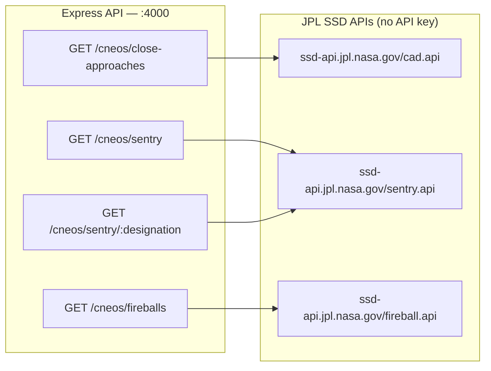
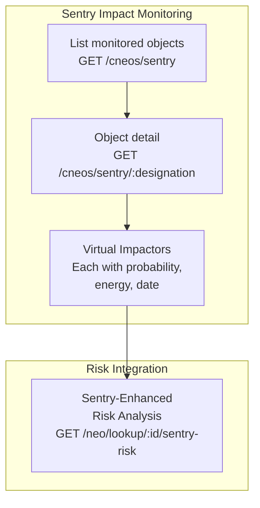

# CNEOS / SSD API

> JPL Small-Body Database & CNEOS Close Approach / Sentry / Fireball APIs

## Data Sources





## Data Source

- **Close Approach**: `https://ssd-api.jpl.nasa.gov/cad.api`
- **Sentry**: `https://ssd-api.jpl.nasa.gov/sentry.api`
- **Fireballs**: `https://ssd-api.jpl.nasa.gov/fireball.api`

> These APIs do **not** require a NASA API key.

---

## Endpoints

### 1. `GET /api/v1/cneos/close-approaches`

Retrieve upcoming close approach data for Near-Earth Objects.

**Query Parameters:**

| Parameter | Type | Default | Description |
|-----------|------|---------|-------------|
| `date_min` | string | `now` | Start date (YYYY-MM-DD or `now`) |
| `date_max` | string | `+60` | End date (YYYY-MM-DD or `+N` days) |
| `dist_max` | string | `10LD` | Max distance (e.g. `10LD`, `0.05AU`) |
| `sort` | string | `dist` | Sort field |
| `limit` | number | — | Max results |
| `pha` | boolean | — | Filter potentially hazardous only |

**Response:**

```json
{
  "success": true,
  "data": {
    "totalCount": 42,
    "dateRange": { "min": "now", "max": "+60 days" },
    "approaches": [
      {
        "designation": "2024 AB",
        "fullname": "(2024 AB)",
        "approachDate": "2026-03-15 12:30",
        "distanceKm": 1500000.5,
        "distanceLunar": 3.9,
        "velocityRelative": 12.5,
        "absoluteMagnitude": 24.3,
        "diameter": 0.05
      }
    ]
  }
}
```

---

### 2. `GET /api/v1/cneos/sentry`

List all objects being monitored by the CNEOS Sentry impact monitoring system.

**Query Parameters:**

| Parameter | Type | Description |
|-----------|------|-------------|
| `ps_min` | number | Min Palermo scale value |
| `ip_min` | number | Min impact probability |
| `h_max` | number | Max absolute magnitude |

**Response:**

```json
{
  "success": true,
  "data": {
    "totalCount": 5,
    "objects": [
      {
        "designation": "29075",
        "fullname": "29075 (1950 DA)",
        "absoluteMagnitude": 17.1,
        "diameter": 1.3,
        "impactCount": 114,
        "impactProbability": 0.00023,
        "palermoCumulative": -1.42,
        "palermoMax": -2.01,
        "torinoMax": 0,
        "impactDateRange": "2880-2880",
        "lastObservation": "2024-01-15",
        "velocityInfinity": 14.2
      }
    ]
  }
}
```

---

### 3. `GET /api/v1/cneos/sentry/:designation`

Get detailed Sentry data for a specific object including all virtual impactors.

**Path Parameters:**

| Parameter | Type | Description |
|-----------|------|-------------|
| `designation` | string | Asteroid designation (e.g. `29075`) |

**Response includes:** cumulative impact probability, Palermo/Torino scale, observation arc, mass, impact energy, and a list of all virtual impactors with individual probabilities.

---

### 4. `GET /api/v1/cneos/fireballs`

Retrieve fireball (bolide) event data from atmospheric entries.

**Query Parameters:**

| Parameter | Type | Default | Description |
|-----------|------|---------|-------------|
| `date_min` | string | — | Start date YYYY-MM-DD |
| `date_max` | string | — | End date YYYY-MM-DD |
| `limit` | number | `20` | Max results |
| `sort` | string | `-date` | Sort field (prefix `-` for descending) |
| `energy_min` | number | — | Min impact energy in kilotons |
| `req_loc` | boolean | — | Require location data |

**Response:**

```json
{
  "success": true,
  "data": {
    "totalCount": 20,
    "fireballs": [
      {
        "date": "2024-12-01 08:15:30",
        "latitude": 45.2,
        "latitudeDirection": "N",
        "longitude": -73.5,
        "longitudeDirection": "W",
        "altitude": 25.3,
        "velocity": 18.5,
        "totalRadiatedEnergy": 1.2e10,
        "impactEnergy": 0.12,
        "location": "45.2°N, 73.5°W"
      }
    ]
  }
}
```

> **Fields added**: `velocity` (km/s), `latitudeDirection` (N/S), `longitudeDirection` (E/W).
