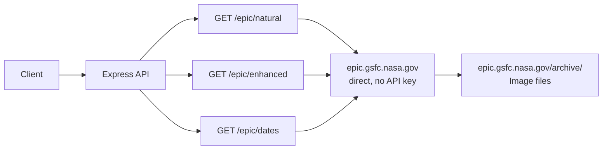

# EPIC API

> Earth Polychromatic Imaging Camera — full-disc Earth imagery from DSCOVR

## Data Flow



## Data Source

`https://epic.gsfc.nasa.gov` — direct access, no API key required.
Images served from `https://epic.gsfc.nasa.gov/archive/`.

> **Note**: The NASA proxy at `api.nasa.gov/EPIC` is unreliable. This service connects directly to the EPIC server at GSFC.

---

## Endpoints

### 1. `GET /api/v1/epic/natural`

Get latest natural color Earth images from the DSCOVR satellite.

**Query Parameters:**

| Parameter | Type | Default | Description |
|-----------|------|---------|-------------|
| `date` | string | latest | Specific date YYYY-MM-DD |

**Response:**

```json
{
  "success": true,
  "data": {
    "totalCount": 12,
    "imageType": "natural",
    "images": [
      {
        "identifier": "20260207003600",
        "caption": "This image was taken...",
        "imageFilename": "epic_1b_20260207003600",
        "date": "2026-02-07 00:36:00",
        "imageUrl": "https://epic.gsfc.nasa.gov/archive/natural/2026/02/07/png/epic_1b_20260207003600.png",
        "version": "03",
        "centroidCoordinates": { "latitude": 5.2, "longitude": -120.3 },
        "dscovrPosition": { "x": -1283000, "y": -655000, "z": -92000 },
        "lunarPosition": { "x": 200000, "y": -350000, "z": 15000 },
        "sunPosition": { "x": 148000000, "y": 12000000, "z": 5000000 },
        "attitudeQuaternions": { "q0": 0.318, "q1": -0.012, "q2": 0.035, "q3": 0.947 }
      }
    ]
  }
}
```

> **Fields added**: `version` (processing version), `attitudeQuaternions` (spacecraft orientation quaternion q0-q3).
```

---

### 2. `GET /api/v1/epic/enhanced`

Get enhanced color Earth images (color-corrected and contrast-enhanced).

**Query Parameters:** Same as natural.

**Response:** Same structure as natural, with `imageType: "enhanced"`.

---

### 3. `GET /api/v1/epic/dates`

Get list of available dates for EPIC imagery.

**Query Parameters:**

| Parameter | Type | Default | Description |
|-----------|------|---------|-------------|
| `type` | query | `natural` | `natural` or `enhanced` |

**Response:**

```json
{
  "success": true,
  "data": ["2026-02-07", "2026-02-06", "2026-02-05"]
}
```
