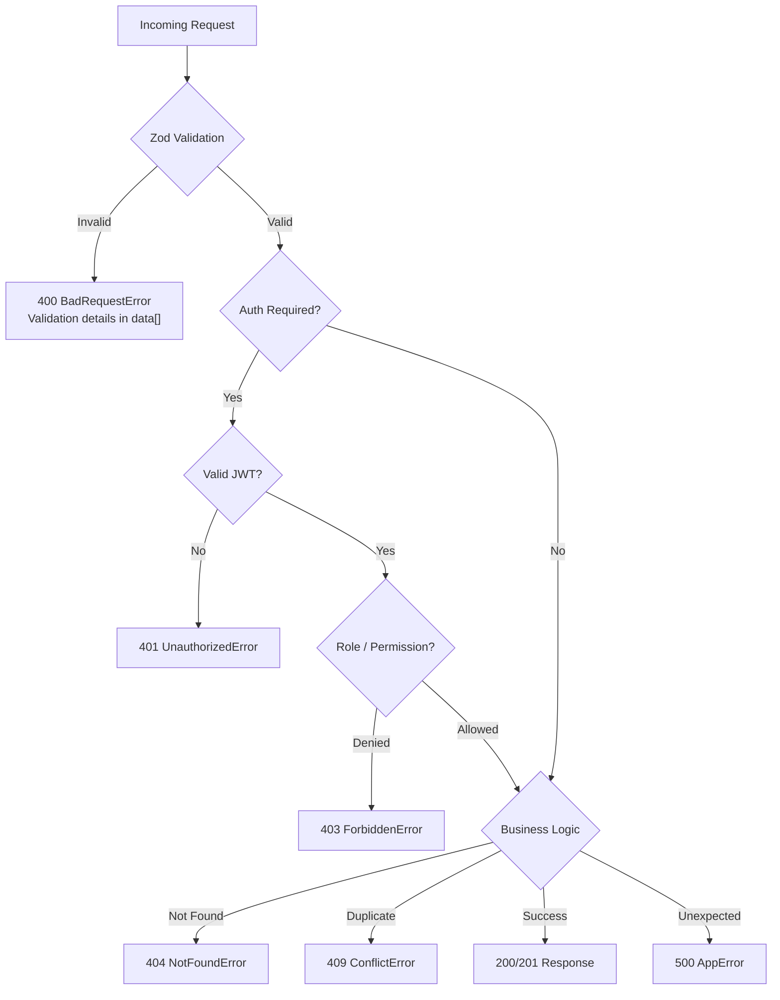

# Error Codes & Error Handling

> Standardized error responses across all API endpoints

## Error Handling Flow



## Error Response Format

All errors follow a consistent JSON structure:

```json
{
  "success": false,
  "message": "Human-readable error description",
  "error": "Error class name"
}
```

For validation errors:

```json
{
  "success": false,
  "message": "Validation failed",
  "error": "Bad Request",
  "data": [
    {
      "code": "too_small",
      "minimum": 8,
      "path": ["password"],
      "message": "Password must be at least 8 characters"
    }
  ]
}
```

---

## HTTP Status Codes

| Status | Error Class | Description | Common Triggers |
|--------|-------------|-------------|-----------------|
| `400` | `BadRequestError` | Bad Request | Invalid input, validation failure |
| `401` | `UnauthorizedError` | Unauthorized | Missing/invalid token, wrong credentials |
| `403` | `ForbiddenError` | Forbidden | Insufficient role/permissions (RBAC) |
| `404` | `NotFoundError` | Not Found | Resource doesn't exist |
| `409` | `ConflictError` | Conflict | Duplicate entry (email, watchlist item) |
| `429` | `TooManyRequestsError` | Too Many Requests | Rate limit exceeded |
| `500` | `AppError` | Internal Server Error | Unexpected server error |

---

## Error Scenarios by Endpoint

### Auth Errors

| Endpoint | Status | Scenario |
|----------|--------|----------|
| `POST /auth/register` | `400` | Validation: name < 2 chars, invalid email, weak password |
| `POST /auth/register` | `409` | Email already registered |
| `POST /auth/login` | `400` | Missing email or password |
| `POST /auth/login` | `401` | Invalid email or password |
| `POST /auth/refresh` | `401` | Invalid or expired refresh token |
| `GET /auth/profile` | `401` | Missing or invalid Bearer token |
| `GET /auth/profile` | `404` | User account deleted |

### NEO Errors

| Endpoint | Status | Scenario |
|----------|--------|----------|
| `GET /neo/feed` | `500` | NASA API request failed (timeout / rate limit) |
| `GET /neo/lookup/:id` | `500` | NASA API lookup failed |
| `GET /neo/risk` | `500` | NASA API or analysis failure |

### Watchlist Errors

| Endpoint | Status | Scenario |
|----------|--------|----------|
| `POST /watchlist` | `400` | Missing asteroidId or asteroidName |
| `POST /watchlist` | `401` | Not authenticated |
| `POST /watchlist` | `409` | Asteroid already in watchlist |
| `DELETE /watchlist/:id` | `401` | Not authenticated |
| `DELETE /watchlist/:id` | `404` | Asteroid not in watchlist |

### Alert Errors

| Endpoint | Status | Scenario |
|----------|--------|----------|
| `GET /alerts` | `401` | Not authenticated |
| `GET /alerts/unread-count` | `401` | Not authenticated |
| `PATCH /alerts/:id/read` | `401` | Not authenticated |
| `PATCH /alerts/read-all` | `401` | Not authenticated |

### Rate Limit Errors

| Limiter | Applies To | Response |
|---------|-----------|----------|
| Global | All endpoints | `429` — "Too many requests, please try again later" |
| Auth | `/auth/*` | `429` — "Too many authentication attempts, please try again later" |
| NASA API | `/neo/*` | `429` — "NASA API rate limit exceeded, please wait" |

---

## RBAC Permission Errors

When a user lacks the required role or permission:

```json
{
  "success": false,
  "message": "Forbidden: insufficient permissions",
  "error": "Forbidden"
}
```

| Middleware | Status | Trigger |
|-----------|--------|---------|
| `requireRole(roles)` | `403` | User's role not in allowed list |
| `requirePermission(resource, action)` | `403` | User lacks permission for the action |
| `requireOwnership(param)` | `403` | User doesn't own the resource (non-ADMIN) |

---

## Validation Error Details

Validation uses Zod schemas. Failed validations return `400` with issue details:

```json
{
  "success": false,
  "message": "Validation failed",
  "data": [
    {
      "code": "invalid_string",
      "validation": "email",
      "path": ["email"],
      "message": "Invalid email address"
    },
    {
      "code": "too_small",
      "minimum": 8,
      "type": "string",
      "path": ["password"],
      "message": "Password must be at least 8 characters"
    }
  ]
}
```

Each issue includes:
- `code` — Zod error code
- `path` — Array path to the invalid field
- `message` — Human-readable error message
