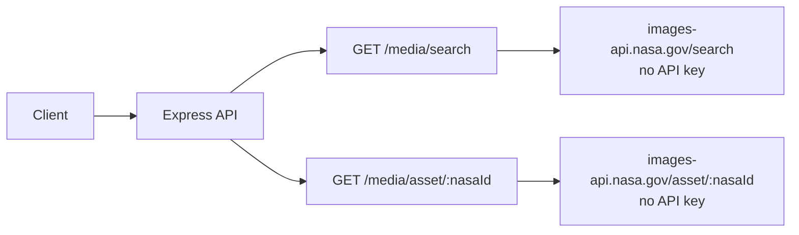

# NASA Image & Video Library API

> Search and retrieve NASA media assets (images, videos, audio)

## Data Flow



## Data Source

`https://images-api.nasa.gov` — does **not** require an API key.

---

## Endpoints

### 1. `GET /api/v1/media/search`

Search the NASA Image and Video Library.

**Query Parameters:**

| Parameter | Type | Default | Description |
|-----------|------|---------|-------------|
| `q` | string | — | Search query (required) |
| `media_type` | string | — | `image`, `video`, or `audio` |
| `year_start` | number | — | Filter by start year |
| `year_end` | number | — | Filter by end year |
| `page` | number | `1` | Page number |

**Response:**

```json
{
  "success": true,
  "data": {
    "totalHits": 1234,
    "query": "asteroid",
    "hasMore": true,
    "items": [
      {
        "nasaId": "PIA12345",
        "title": "Asteroid Bennu Close-Up",
        "description": "OSIRIS-REx captured this image...",
        "mediaType": "image",
        "dateCreated": "2024-01-15T00:00:00Z",
        "center": "JPL",
        "keywords": ["asteroid", "OSIRIS-REx", "Bennu"],
        "thumbnailUrl": "https://images-assets.nasa.gov/.../thumb.jpg",
        "collectionUrl": "https://images-api.nasa.gov/asset/PIA12345",
        "photographer": "NASA/JPL",
        "location": "Space"
      }
    ]
  }
}
```

---

### 2. `GET /api/v1/media/asset/:nasaId`

Get all asset files for a specific NASA media ID.

**Path Parameters:**

| Parameter | Type | Description |
|-----------|------|-------------|
| `nasaId` | string | NASA media ID (e.g. `PIA12345`) |

**Response:**

```json
{
  "success": true,
  "data": [
    { "url": "https://images-assets.nasa.gov/.../orig.jpg", "type": "jpg" },
    { "url": "https://images-assets.nasa.gov/.../thumb.jpg", "type": "jpg" },
    { "url": "https://images-assets.nasa.gov/.../metadata.json", "type": "json" }
  ]
}
```
