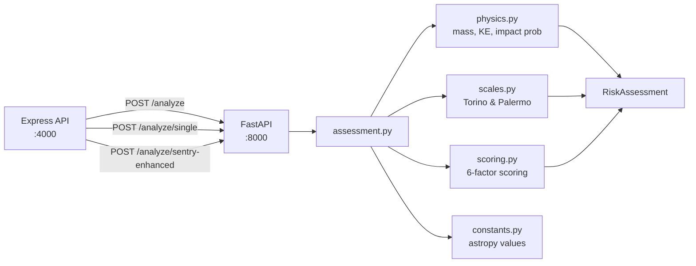

# NEO (Near-Earth Objects) API

> 5 endpoints — NASA NeoWs data feed, asteroid lookup, and scientific risk analysis engine

## Data Flow Overview

```mermaid
flowchart TB
    subgraph Client
        C[Client Request]
    end

    subgraph Express["Express API — :4000"]
        FEED["GET /neo/feed"]
        LOOK["GET /neo/lookup/:id"]
        RISK["GET /neo/risk"]
        SRISK["GET /neo/lookup/:id/risk"]
        SENTRY["GET /neo/lookup/:id/sentry-risk"]
    end

    subgraph NASA["NASA NeoWs"]
        NFEED["api.nasa.gov/neo/rest/v1/feed"]
        NLOOK["api.nasa.gov/neo/rest/v1/neo/:id"]
    end

    subgraph CNEOS_API["CNEOS Sentry"]
        SAPI["ssd-api.jpl.nasa.gov/sentry.api"]
    end

    subgraph Python["Python Risk Engine — :8000"]
        BATCH["POST /analyze"]
        SINGLE["POST /analyze/single"]
        SENRY["POST /analyze/sentry-enhanced"]
    end

    subgraph DB[(PostgreSQL)]
        CACHE[(CachedAsteroid)]
    end

    C --> FEED & LOOK & RISK & SRISK & SENTRY

    FEED --> NFEED --> CACHE
    LOOK --> CACHE -- "miss / stale" --> NLOOK
    RISK --> NFEED --> BATCH
    SRISK --> NLOOK --> SINGLE
    SENTRY --> NLOOK & SAPI --> SENRY
```

## Endpoints

| # | Method | Endpoint | Auth | Rate Limit |
|---|--------|----------|------|------------|
| 1 | `GET` | `/api/v1/neo/feed` | No | 30 req / min |
| 2 | `GET` | `/api/v1/neo/lookup/:asteroidId` | No | 30 req / min |
| 3 | `GET` | `/api/v1/neo/risk` | No | 30 req / min |
| 4 | `GET` | `/api/v1/neo/lookup/:asteroidId/risk` | No | 30 req / min |
| 5 | `GET` | `/api/v1/neo/lookup/:asteroidId/sentry-risk` | No | 30 req / min |

## Data Source

All NEO data is fetched from the [NASA NeoWs (Near Earth Object Web Service)](https://api.nasa.gov/neo/rest/v1) API.

---

## 1. Get NEO Feed

```
GET /api/v1/neo/feed
```

Fetch Near-Earth Objects for a date range. Data is sourced from NASA's NeoWs API and automatically cached in the database.

### Query Parameters

| Param | Type | Required | Default | Description |
|-------|------|----------|---------|-------------|
| `start_date` | string | No | Today | Start date in `YYYY-MM-DD` format |
| `end_date` | string | No | Today | End date in `YYYY-MM-DD` format |

> **Note**: NASA limits date ranges to a maximum of 7 days per request.

### Example Request

```
GET /api/v1/neo/feed?start_date=2026-02-07&end_date=2026-02-14
```

### Success Response — `200 OK`

```json
{
  "success": true,
  "message": "NEO feed retrieved successfully",
  "data": {
    "element_count": 42,
    "near_earth_objects": {
      "2026-02-07": [
        {
          "id": "2465633",
          "neo_reference_id": "2465633",
          "name": "465633 (2009 JR5)",
          "nasa_jpl_url": "https://ssd.jpl.nasa.gov/...",
          "absolute_magnitude_h": 20.48,
          "is_potentially_hazardous_asteroid": true,
          "estimated_diameter": {
            "kilometers": {
              "estimated_diameter_min": 0.2170475943,
              "estimated_diameter_max": 0.4853700422
            },
            "meters": {
              "estimated_diameter_min": 217.0475943,
              "estimated_diameter_max": 485.3700422
            }
          },
          "close_approach_data": [
            {
              "close_approach_date": "2026-02-07",
              "close_approach_date_full": "2026-Feb-07 09:30",
              "epoch_date_close_approach": 1738918200000,
              "relative_velocity": {
                "kilometers_per_second": "18.512",
                "kilometers_per_hour": "66643.2",
                "miles_per_hour": "41403.1"
              },
              "miss_distance": {
                "astronomical": "0.032",
                "lunar": "12.45",
                "kilometers": "4800000",
                "miles": "2982624"
              },
              "orbiting_body": "Earth"
            }
          ]
        }
      ]
    }
  }
}
```

### Side Effects

- Asteroids are **cached in the database** in the background (non-blocking)
- Cached data includes: NEO reference ID, name, magnitude, hazardous status, diameter range, full JSON

---

## 2. Lookup Asteroid

```
GET /api/v1/neo/lookup/:asteroidId
```

Get detailed information about a specific asteroid by its NEO reference ID. Uses a caching strategy to reduce NASA API calls.

### Path Parameters

| Param | Type | Description |
|-------|------|-------------|
| `asteroidId` | string | NEO reference ID (e.g., `2465633`) |

### Caching Behavior

| Condition | Action |
|-----------|--------|
| Cached & < 1 hour old | Returns cached data (no NASA call) |
| Cached & > 1 hour old | Fetches fresh data, updates cache |
| Not cached | Fetches from NASA, creates cache entry |

### Example Request

```
GET /api/v1/neo/lookup/2465633
```

### Success Response — `200 OK`

```json
{
  "success": true,
  "message": "Asteroid data retrieved",
  "data": {
    "id": "2465633",
    "neo_reference_id": "2465633",
    "name": "465633 (2009 JR5)",
    "nasa_jpl_url": "https://ssd.jpl.nasa.gov/...",
    "absolute_magnitude_h": 20.48,
    "is_potentially_hazardous_asteroid": true,
    "estimated_diameter": {
      "kilometers": {
        "estimated_diameter_min": 0.2170475943,
        "estimated_diameter_max": 0.4853700422
      },
      "meters": {
        "estimated_diameter_min": 217.0475943,
        "estimated_diameter_max": 485.3700422
      }
    },
    "close_approach_data": [
      {
        "close_approach_date": "2026-02-07",
        "relative_velocity": {
          "kilometers_per_second": "18.512",
          "kilometers_per_hour": "66643.2"
        },
        "miss_distance": {
          "astronomical": "0.032",
          "lunar": "12.45",
          "kilometers": "4800000"
        },
        "orbiting_body": "Earth"
      }
    ]
  }
}
```

---

## 3. Risk Analysis

```
GET /api/v1/neo/risk
```

Perform risk assessment on all NEOs for a date range. Fetches feed data and runs each asteroid through the **Risk Scoring Engine**.

### Query Parameters

| Param | Type | Required | Default | Description |
|-------|------|----------|---------|-------------|
| `start_date` | string | No | Today | Start date `YYYY-MM-DD` |
| `end_date` | string | No | Today | End date `YYYY-MM-DD` |

### Example Request

```
GET /api/v1/neo/risk?start_date=2026-02-07&end_date=2026-02-10
```

### Success Response — `200 OK`

```json
{
  "success": true,
  "message": "Risk analysis completed",
  "data": {
    "totalAnalyzed": 42,
    "assessments": [
      {
        "asteroidId": "2465633",
        "name": "465633 (2009 JR5)",
        "riskLevel": "HIGH",
        "riskScore": 62,
        "hazardous": true,
        "estimatedDiameter": 0.485,
        "missDistance": 4800000,
        "velocity": 66643.2,
        "closestApproachDate": "2026-02-07"
      },
      {
        "asteroidId": "3542519",
        "name": "(2010 PK9)",
        "riskLevel": "LOW",
        "riskScore": 12,
        "hazardous": false,
        "estimatedDiameter": 0.045,
        "missDistance": 25000000,
        "velocity": 32100.5,
        "closestApproachDate": "2026-02-08"
      }
    ]
  }
}
```

> Results are **sorted by risk score descending** (most dangerous first).

---

## 4. Single Asteroid Risk Analysis

```
GET /api/v1/neo/lookup/:asteroidId/risk
```

Perform detailed risk analysis on a single asteroid via the **Python Scientific Risk Engine**.

### Path Parameters

| Param | Type | Description |
|-------|------|-------------|
| `asteroidId` | string | NEO reference ID (e.g., `3542519`) |

### Example Request

```
GET /api/v1/neo/lookup/3542519/risk
```

### Success Response — `200 OK`

```json
{
  "success": true,
  "message": "Asteroid risk analysis completed",
  "data": {
    "success": true,
    "engine": "python-scientific",
    "data": {
      "asteroid_id": "3542519",
      "name": "(2010 PK9)",
      "risk_level": "HIGH",
      "risk_score": 57.9,
      "hazardous": true,
      "estimated_diameter_km": 0.680516,
      "miss_distance_km": 6578671.38,
      "velocity_km_s": 30.9354,
      "kinetic_energy_mt": 1172.299149,
      "torino_scale": 0,
      "palermo_scale": -10,
      "impact_probability": 1e-15,
      "relative_size": "Football stadium",
      "score_breakdown": {
        "hazardous_points": 15.0,
        "diameter_points": 11.58,
        "miss_distance_points": 12.0,
        "velocity_points": 6.44,
        "kinetic_energy_points": 12.88,
        "orbital_uncertainty_points": 7.0
      }
    }
  }
}
```

---

## 5. Sentry-Enhanced Risk Analysis

```
GET /api/v1/neo/lookup/:asteroidId/sentry-risk
```

Perform risk analysis enhanced with real **CNEOS Sentry** impact monitoring data. Combines asteroid data from NeoWs with Sentry's real impact probabilities, Palermo/Torino scales, and virtual impactor counts.

### Path Parameters

| Param | Type | Description |
|-------|------|-------------|
| `asteroidId` | string | NEO reference ID (e.g., `29075`) |

### Example Request

```
GET /api/v1/neo/lookup/29075/sentry-risk
```

### Success Response — `200 OK`

Returns a `SentryEnhancedAssessment` which extends the standard `RiskAssessment` with:

| Field | Type | Description |
|-------|------|-------------|
| `sentry_available` | boolean | Whether Sentry data was found |
| `sentry_designation` | string | Sentry designation |
| `real_impact_probability` | float | CNEOS cumulative impact probability |
| `real_palermo_cumulative` | float | Real cumulative Palermo scale |
| `real_palermo_max` | float | Real maximum Palermo scale |
| `real_torino_max` | integer | Real maximum Torino scale |
| `real_impact_energy_mt` | float | Sentry-computed impact energy (MT) |
| `total_virtual_impactors` | integer | Number of virtual impactor scenarios |
| `data_source` | string | `"CNEOS Sentry + NASA NeoWs"` |

> Falls back to standard risk analysis if the asteroid is not in the Sentry system.

---

## Risk Scoring Engine — Python Scientific Microservice

Risk analysis is powered by a **Python FastAPI microservice** using NumPy, SciPy, scikit-learn, and **astropy** for scientific-grade threat assessment.

> See [RISK_ENGINE.md](./RISK_ENGINE.md) for full architecture documentation.

### Architecture



### 6-Factor Scoring (0–100 scale)

| Factor | Max Points | Method |
|--------|-----------|--------|
| **Hazardous Flag** | 15 | NASA PHA classification |
| **Diameter** | 20 | Log-scaled (1m→0pts, 10km→20pts) |
| **Miss Distance** | 25 | Lunar distance tiers (< 0.5 LD → 25pts) + MOID bonus |
| **Velocity** | 15 | Normalized to max NEO velocity (~72 km/s) |
| **Kinetic Energy** | 15 | Log-scaled megatons TNT equivalent |
| **Orbital Uncertainty** | 10 | NASA orbit condition code (0–9) when available, proximity-based fallback |

### Physics Computations

| Metric | Formula | Description |
|--------|---------|-------------|
| **Mass** | ρ × (4/3)πr³ | Sphere model, S-type density 2600 kg/m³ (astropy constants) |
| **Kinetic Energy** | ½mv² | Joules → Megatons TNT |
| **H → Diameter** | 1329/√(p_v) × 10^(-H/5) | Absolute magnitude to km (albedo=0.14) |
| **Torino Scale** | 0–10 | Official NASA/IAU 2D energy×probability regions |
| **Palermo Scale** | log₁₀(Pᵢ/fᵦΔt) | Logarithmic comparison vs background rate |
| **Impact Probability** | MOID-based (preferred) | Uses Minimum Orbit Intersection Distance from orbital_data |
| **Impact Probability** | Gravitational focusing (fallback) | Cross-section with gravitational enhancement |

### Orbital Data Integration

When available from NASA NeoWs lookup, the engine uses real orbital elements:

| Parameter | Source | Usage |
|-----------|--------|-------|
| **MOID** | `orbital_data.minimum_orbit_intersection` | Primary impact probability metric |
| **Orbit Uncertainty** | `orbital_data.orbit_uncertainty` (0–9) | Direct scoring factor (10 pts) |
| **Eccentricity** | `orbital_data.eccentricity` | Orbit shape analysis |
| **Semi-Major Axis** | `orbital_data.semi_major_axis` | Orbit size classification |
| **Inclination** | `orbital_data.inclination` | Orbit plane assessment |

### Risk Levels

| Level | Score Range | Meaning |
|-------|------------|---------|
| `CRITICAL` | 75–100 | Extremely close, large, fast, high-energy asteroid |
| `HIGH` | 50–74 | Significant threat parameters |
| `MEDIUM` | 25–49 | Moderate concern |
| `LOW` | 0–24 | Minimal risk |
