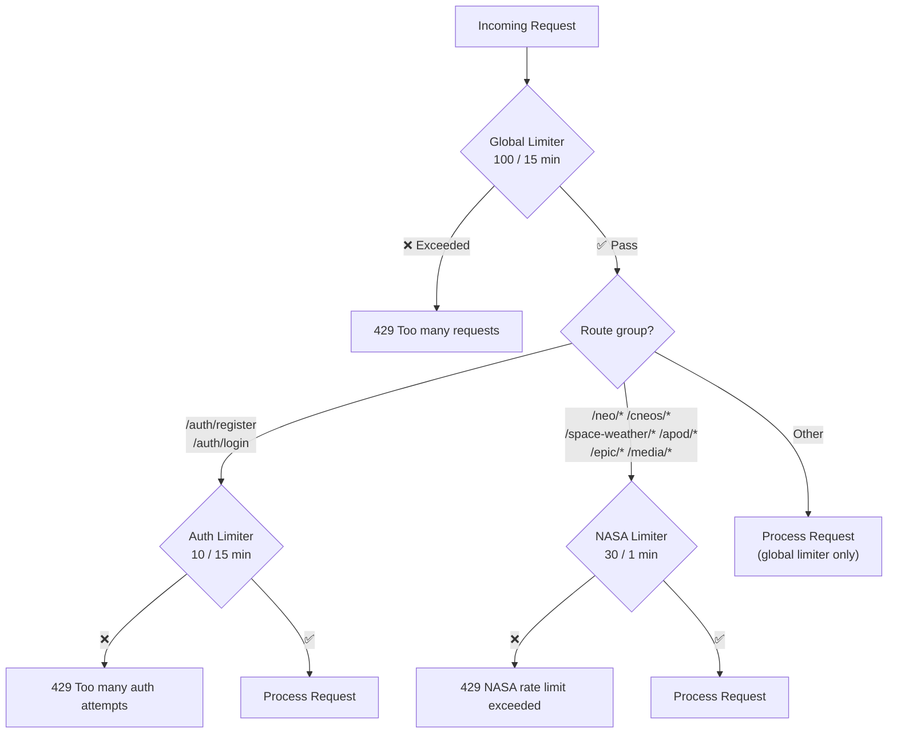

# Rate Limiting

> Protection against abuse and API overuse

## Overview

The API uses three tiers of rate limiting to protect against abuse, distributed across different endpoint groups.

---

## Rate Limit Tiers

| Tier | Applies To | Window | Max Requests | Purpose |
|------|-----------|--------|--------------|---------|
| **Global** | All endpoints | 15 minutes | 100 | General abuse prevention |
| **Auth** | `/api/v1/auth/register`, `/api/v1/auth/login` | 15 minutes | 10 | Brute-force protection |
| **NASA API** | `/api/v1/neo/*`, `/cneos/*`, `/space-weather/*`, `/apod/*`, `/epic/*`, `/media/*` | 1 minute | 30 | NASA API quota management |

---

## Response When Exceeded

When a rate limit is hit, the API returns **`429 Too Many Requests`**:

```json
{
  "success": false,
  "message": "Too many requests, please try again later"
}
```

### Tier-Specific Messages

| Tier | Message |
|------|---------|
| Global | `Too many requests, please try again later` |
| Auth | `Too many authentication attempts, please try again later` |
| NASA API | `NASA API rate limit exceeded, please wait` |

---

## Rate Limit Headers

Standard rate limit headers are included in every response:

| Header | Description |
|--------|-------------|
| `RateLimit-Limit` | Maximum requests allowed in the window |
| `RateLimit-Remaining` | Requests remaining in current window |
| `RateLimit-Reset` | Seconds until the window resets |

> Legacy headers (`X-RateLimit-*`) are disabled.

---

## Configuration

Rate limits are configurable via environment variables:

| Variable | Default | Description |
|----------|---------|-------------|
| `RATE_LIMIT_WINDOW_MS` | `900000` (15 min) | Global window duration in ms |
| `RATE_LIMIT_MAX_REQUESTS` | `100` | Global max requests per window |

Auth and NASA API rate limits are hardcoded for security:
- Auth: 10 requests / 15 minutes (prevents brute-force)
- NASA: 30 requests / 1 minute (respects NASA API quotas)

---

## Rate Limit Flow


