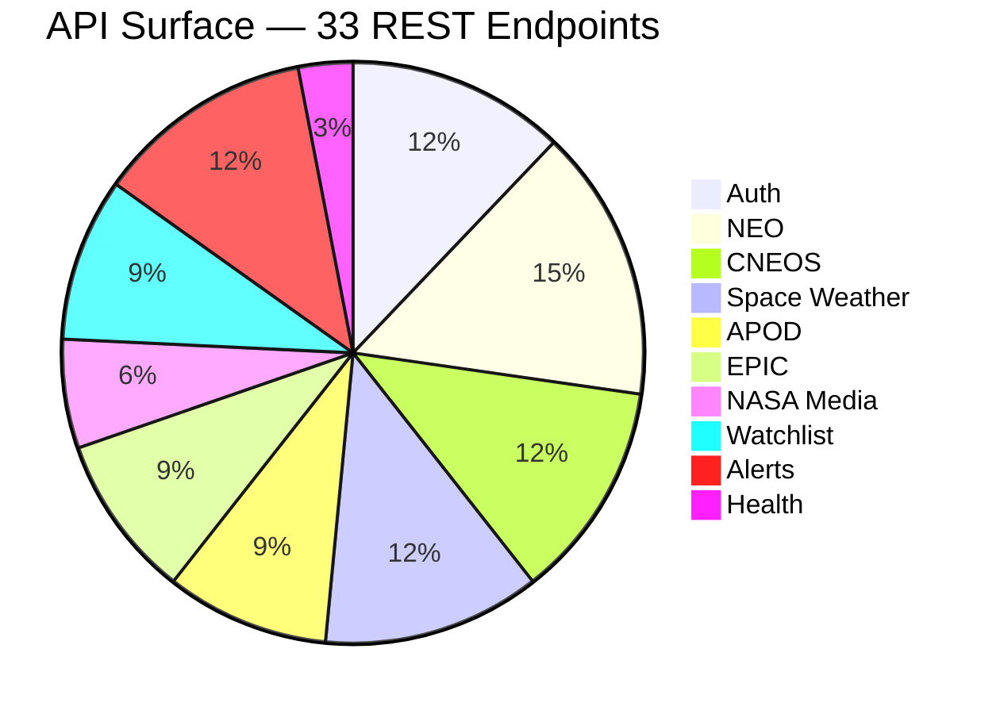
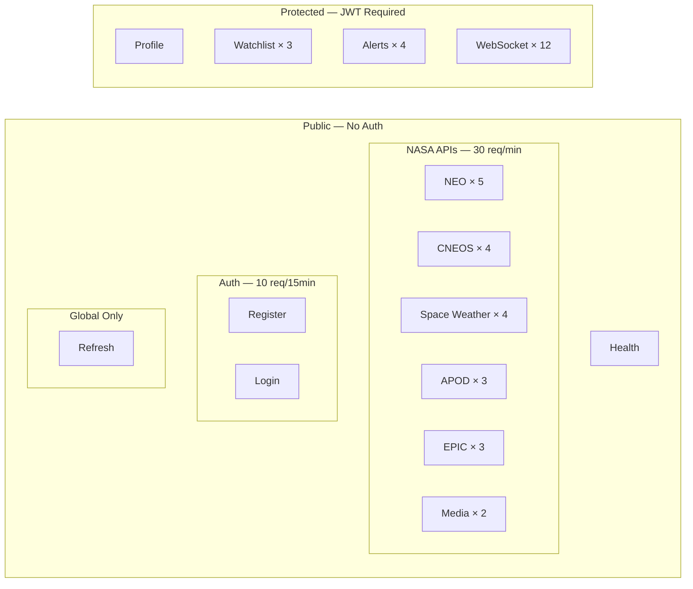

# Cosmic Watch API — Documentation

> Full-stack platform for Real-Time Near-Earth Object (NEO) Monitoring

## API Summary

| Metric | Count |
|--------|-------|
| **Total REST Endpoints** | **33** |
| **WebSocket Events** | **5 client → server, 7 server → client** |
| **Total API Surface** | **45** |





## Endpoint Overview

| # | Method | Endpoint | Auth | Rate Limit | Description |
|---|--------|----------|------|------------|-------------|
| 1 | `GET` | `/api/v1/health` | No | Global | Server health check |
| 2 | `POST` | `/api/v1/auth/register` | No | 10/15min | Register new user |
| 3 | `POST` | `/api/v1/auth/login` | No | 10/15min | Login & get tokens |
| 4 | `POST` | `/api/v1/auth/refresh` | No | Global | Refresh JWT tokens |
| 5 | `GET` | `/api/v1/auth/profile` | Yes | Global | Get user profile |
| 6 | `GET` | `/api/v1/neo/feed` | No | 30/min | Fetch NEO feed by date range |
| 7 | `GET` | `/api/v1/neo/lookup/:asteroidId` | No | 30/min | Lookup specific asteroid |
| 8 | `GET` | `/api/v1/neo/risk` | No | 30/min | Batch risk analysis (Python engine) |
| 9 | `GET` | `/api/v1/neo/lookup/:asteroidId/risk` | No | 30/min | Single asteroid risk analysis |
| 10 | `GET` | `/api/v1/neo/lookup/:asteroidId/sentry-risk` | No | 30/min | Sentry-enhanced risk analysis |
| 11 | `GET` | `/api/v1/cneos/close-approaches` | No | 30/min | CNEOS close approach data |
| 12 | `GET` | `/api/v1/cneos/sentry` | No | 30/min | Sentry impact monitoring list |
| 13 | `GET` | `/api/v1/cneos/sentry/:designation` | No | 30/min | Sentry object detail |
| 14 | `GET` | `/api/v1/cneos/fireballs` | No | 30/min | Fireball / bolide events |
| 15 | `GET` | `/api/v1/space-weather/cme` | No | 30/min | Coronal Mass Ejections |
| 16 | `GET` | `/api/v1/space-weather/flares` | No | 30/min | Solar flare events |
| 17 | `GET` | `/api/v1/space-weather/storms` | No | 30/min | Geomagnetic storms |
| 18 | `GET` | `/api/v1/space-weather/notifications` | No | 30/min | Space weather notifications |
| 19 | `GET` | `/api/v1/apod/today` | No | 30/min | Astronomy Picture of the Day |
| 20 | `GET` | `/api/v1/apod/random` | No | 30/min | Random APOD(s) |
| 21 | `GET` | `/api/v1/apod/range` | No | 30/min | APOD date range |
| 22 | `GET` | `/api/v1/epic/natural` | No | 30/min | EPIC natural Earth images |
| 23 | `GET` | `/api/v1/epic/enhanced` | No | 30/min | EPIC enhanced Earth images |
| 24 | `GET` | `/api/v1/epic/dates` | No | 30/min | Available EPIC image dates |
| 25 | `GET` | `/api/v1/media/search` | No | 30/min | Search NASA media library |
| 26 | `GET` | `/api/v1/media/asset/:nasaId` | No | 30/min | Get NASA media asset files |
| 27 | `POST` | `/api/v1/watchlist` | Yes | Global | Add asteroid to watchlist |
| 28 | `GET` | `/api/v1/watchlist` | Yes | Global | Get user's watchlist |
| 29 | `DELETE` | `/api/v1/watchlist/:asteroidId` | Yes | Global | Remove from watchlist |
| 30 | `GET` | `/api/v1/alerts` | Yes | Global | Get user's alerts |
| 31 | `GET` | `/api/v1/alerts/unread-count` | Yes | Global | Get unread alert count |
| 32 | `PATCH` | `/api/v1/alerts/read-all` | Yes | Global | Mark all alerts read |
| 33 | `PATCH` | `/api/v1/alerts/:alertId/read` | Yes | Global | Mark single alert read |

## Documentation Index

| Document | Description |
|----------|-------------|
| [API_REFERENCE.md](./API_REFERENCE.md) | Complete API reference with request/response examples |
| [AUTH.md](./AUTH.md) | Authentication & user management (4 endpoints) |
| [NEO.md](./NEO.md) | Near-Earth Object data & risk analysis (5 endpoints) |
| [CNEOS.md](./CNEOS.md) | CNEOS/SSD close approaches, Sentry & fireballs (4 endpoints) |
| [SPACE_WEATHER.md](./SPACE_WEATHER.md) | DONKI space weather — CME, flares, storms (4 endpoints) |
| [APOD.md](./APOD.md) | Astronomy Picture of the Day (3 endpoints) |
| [EPIC.md](./EPIC.md) | DSCOVR EPIC Earth imagery (3 endpoints) |
| [NASA_MEDIA.md](./NASA_MEDIA.md) | NASA Image & Video Library (2 endpoints) |
| [RISK_ENGINE.md](./RISK_ENGINE.md) | Python scientific risk engine architecture |
| [WATCHLIST.md](./WATCHLIST.md) | Asteroid watchlist management (3 endpoints) |
| [ALERTS.md](./ALERTS.md) | Alert & notification system (4 endpoints) |
| [WEBSOCKET.md](./WEBSOCKET.md) | Real-time chat via Socket.io (12 events) |
| [ERROR_CODES.md](./ERROR_CODES.md) | Error handling & HTTP status codes |
| [RATE_LIMITING.md](./RATE_LIMITING.md) | Rate limiting policies |

## Base URL

```
http://localhost:4000/api/v1
```

## Authentication

All protected endpoints require a JWT Bearer token:

```
Authorization: Bearer <accessToken>
```

Tokens are obtained via `/auth/register` or `/auth/login`.

## Standard Response Format

```json
{
  "success": true,
  "message": "Description of the result",
  "data": { },
  "meta": {
    "page": 1,
    "limit": 20,
    "total": 100,
    "totalPages": 5
  }
}
```

## Roles (RBAC)

| Role | Description |
|------|-------------|
| `USER` | Default role — manage own watchlist & alerts |
| `RESEARCHER` | Extended NEO data access |
| `ADMIN` | Full access — manage all resources |

## Tech Stack

| Component | Technology |
|-----------|------------|
| Runtime | Node.js 22 + TypeScript 5.9 |
| Framework | Express 5 |
| Database | PostgreSQL 18 |
| ORM | Prisma 7 |
| Auth | JWT (jsonwebtoken) + bcryptjs |
| Validation | Zod 4 |
| Real-time | Socket.io 4 |
| Risk Engine | Python 3.12 + FastAPI (microservice) |
| Scientific Computing | NumPy, SciPy, scikit-learn, astropy 7 |
| Logger | Pino |
| Containerization | Docker Compose (3 services, multi-stage builds) |
