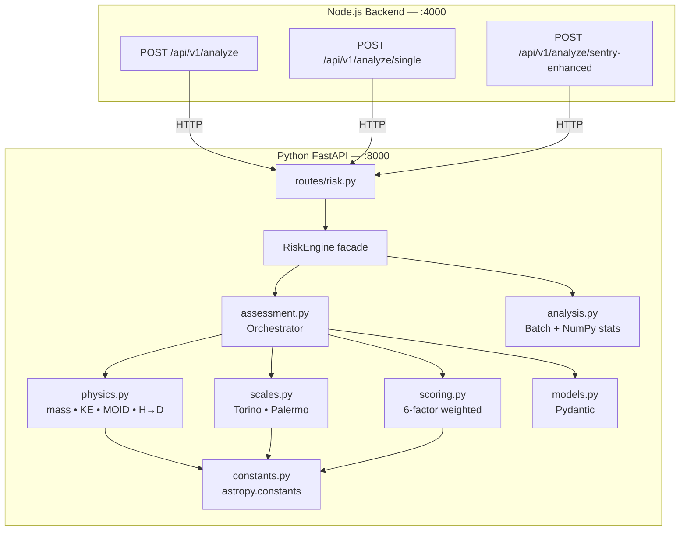
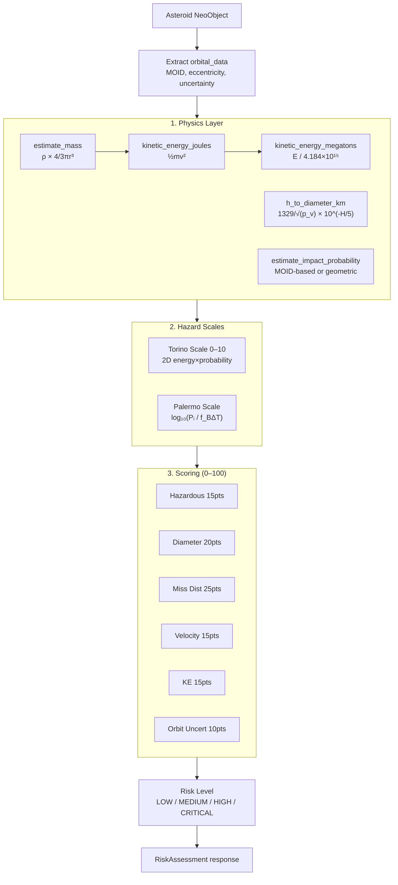
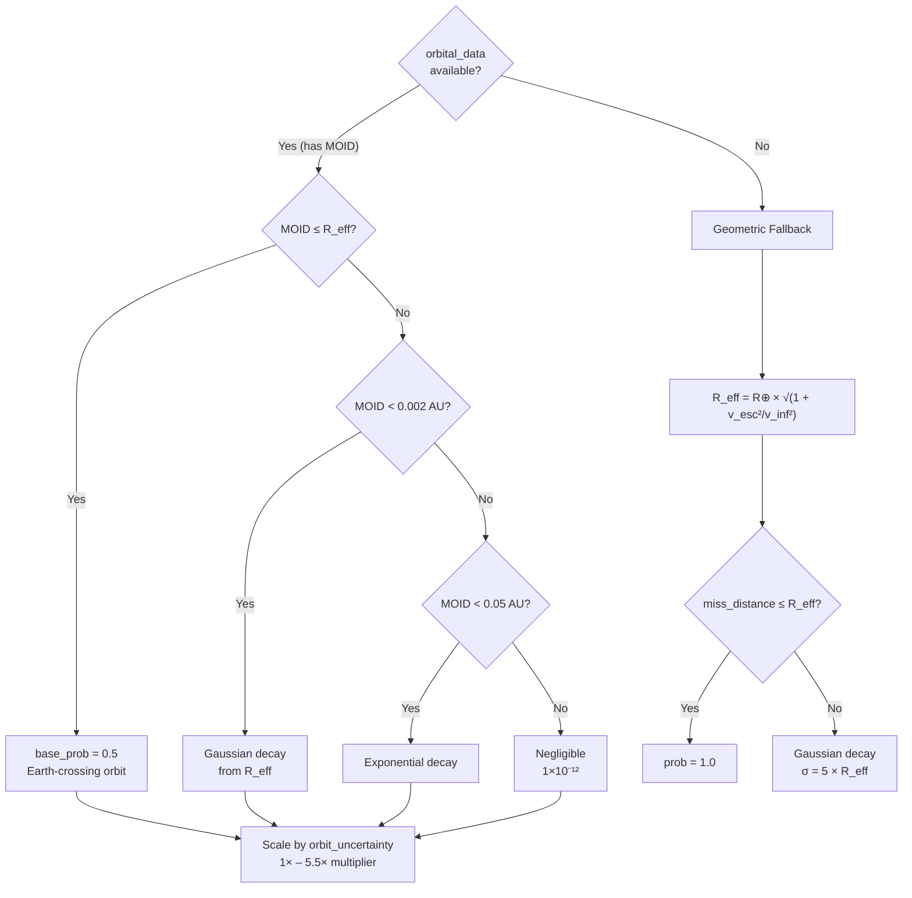

# Risk Engine — Python Scientific Microservice

> Asteroid threat assessment powered by astropy, NumPy, SciPy, and scikit-learn

## Overview

The risk engine is a standalone **Python FastAPI** microservice that receives asteroid data from the Node.js backend and returns comprehensive risk assessments. It runs on **port 8000** and communicates via HTTP/JSON.

## Architecture



## Dependencies

| Package | Version | Purpose |
|---------|---------|---------|
| FastAPI | 0.115.12 | HTTP framework |
| uvicorn | 0.34.2 | ASGI server |
| NumPy | >=1.24,<2.0 | Vectorized computations |
| SciPy | >=1.11,<1.14 | Scientific algorithms |
| scikit-learn | >=1.3,<1.5 | ML utilities |
| **astropy** | **>=6.0,<8.0** | Physical constants, units, coordinate transforms |
| Pydantic | 2.11.1 | Data validation & models |
| httpx | 0.28.1 | Async HTTP client |

---

## Physical Constants (astropy)

All physical constants are derived from `astropy.constants` and `astropy.units` for precision:

| Constant | Value | Source |
|----------|-------|--------|
| Earth radius | 6378.100 km | `astropy.constants.R_earth` |
| Earth mass | 5.972×10²⁴ kg | `astropy.constants.M_earth` |
| Gravitational constant G | 6.674×10⁻¹¹ m³/(kg·s²) | `astropy.constants.G` |
| Astronomical Unit | 149,597,870.7 km | `astropy.constants.au` |
| Escape velocity | 11.180 km/s | Computed: √(2GM/R) |
| S-type asteroid density | 2,600 kg/m³ | Literature value |
| Default albedo (p_v) | 0.14 | IAU convention |

### Density Estimates by Type

| Type | Density (kg/m³) | Description |
|------|-----------------|-------------|
| S-type (silicaceous) | 2,600 | Most common NEAs |
| C-type (carbonaceous) | 1,300 | Dark, primitive |
| M-type (metallic) | 7,800 | Iron-nickel |

---

## Risk Analysis Pipeline



### 1. Physics Computations (`physics.py`)

| Function | Formula | Description |
|----------|---------|-------------|
| `estimate_mass(diameter_km, density)` | `ρ × (4/3)πr³` | Spherical body mass |
| `kinetic_energy_joules(mass, velocity)` | `½mv²` | Kinetic energy in Joules |
| `kinetic_energy_megatons(joules)` | `E / 4.184×10¹⁵` | Convert to MT TNT |
| `h_to_diameter_km(H, albedo)` | `1329/√(p_v) × 10^(-H/5)` | Absolute magnitude → diameter |
| `estimate_impact_probability(...)` | MOID-based or geometric | See below |
| `energy_comparison(energy_mt)` | Closest match | Compare to known events |
| `size_comparison(diameter_km)` | Threshold match | Human-friendly size label |

### Impact Probability — Dual Method



### 2. Torino Scale (`scales.py`)

Official NASA/IAU Torino Scale using 2D energy×probability regions:

| Scale | Condition | Meaning |
|-------|-----------|---------|
| **0** | Palermo < −2 or negligible | No unusual hazard |
| **1** | Palermo ≥ −2, low prob | Normal — merits monitoring |
| **2–4** | Pᵢ ≥ 10⁻⁴ | Meriting concern |
| **5–7** | Pᵢ ≥ 0.01 | Threatening |
| **8** | Pᵢ ≥ 0.99, E < 1 MT | Certain local collision |
| **9** | Pᵢ ≥ 0.99, E ≥ 1 MT | Certain regional devastation |
| **10** | Pᵢ ≥ 0.99, E ≥ 1000 MT | Certain global catastrophe |

Energy thresholds:
- **E1** = 1 MT (locally destructive)
- **E2** = 1,000 MT (globally devastating)

### 3. Palermo Scale (`scales.py`)

```
P = log₁₀(Pᵢ / (f_B × ΔT))

Where:
  Pᵢ  = impact probability
  f_B = 0.03 × E_MT^(-0.8)  — annual background frequency (Brown et al. 2002)
  ΔT  = time window (default 50 years)
```

| Palermo Value | Interpretation |
|---------------|----------------|
| P < −2 | Well below background — no concern |
| −2 ≤ P < 0 | Merits monitoring |
| P ≥ 0 | Above background — serious concern |

### 4. Multi-Factor Scoring (`scoring.py`)

6-factor weighted risk score (0–100):

| # | Factor | Max | Method |
|---|--------|-----|--------|
| 1 | Hazardous flag | 15 | NASA PHA classification →15 or 0 |
| 2 | Diameter | 20 | `log₁₀(D) → clip((log+3)/4×20, 0, 20)` |
| 3 | Miss distance | 25 | Lunar distance tiers + MOID bonus (up to 3 pts) |
| 4 | Velocity | 15 | `v / 72 km/s × 15` |
| 5 | Kinetic energy | 15 | `log₁₀(E_MT) → clip((log+6)/11×15, 0, 15)` |
| 6 | Orbital uncertainty | 10 | NASA code 0–9 → `code/9×10` (or proximity fallback) |

**Orbital uncertainty scoring:**

| Source | Method |
|--------|--------|
| Real NASA data | `orbit_uncertainty` / 9 × 10 pts (0=precise→0pts, 9=uncertain→10pts) |
| Fallback | Proximity estimate: <1 LD→10, <5 LD→7, <20 LD→4, else→1 |

**MOID distance bonus:**

When `moid_au < 0.05`:
```
bonus = (0.05 - moid_au) / 0.05 × 3  # up to 3 extra pts
dist_pts = min(25, dist_pts + bonus)
```

### 5. Risk Levels

| Level | Score | Color |
|-------|-------|-------|
| `LOW` | 0–24 | Green |
| `MEDIUM` | 25–49 | Yellow |
| `HIGH` | 50–74 | Orange |
| `CRITICAL` | 75–100 | Red |

---

## Orbital Data Integration

When a NEO lookup returns `orbital_data` from NASA, the engine extracts:

| Field | Example | Usage |
|-------|---------|-------|
| `minimum_orbit_intersection` | `"0.00208"` AU | MOID → impact probability |
| `orbit_uncertainty` | `"0"` – `"9"` | Direct scoring (10 pts) |
| `eccentricity` | `"0.203"` | Orbit shape |
| `semi_major_axis` | `"1.458"` AU | Orbit size |
| `inclination` | `"6.035"` deg | Orbit plane |
| `orbital_period` | `"643.12"` days | Period |
| `orbit_class.orbit_class_type` | `"APO"` | Apollo, Aten, Amor, etc. |

### OrbitalData Model (23 fields)

```python
class OrbitalData(BaseModel):
    orbit_id: Optional[str]
    orbit_determination_date: Optional[str]
    first_observation_date: Optional[str]
    last_observation_date: Optional[str]
    data_arc_in_days: Optional[int]
    observations_used: Optional[int]
    orbit_uncertainty: Optional[str]          # 0-9 scale
    minimum_orbit_intersection: Optional[str] # MOID in AU
    jupiter_tisserand_invariant: Optional[str]
    epoch_osculation: Optional[str]
    eccentricity: Optional[str]
    semi_major_axis: Optional[str]
    inclination: Optional[str]
    ascending_node_longitude: Optional[str]
    orbital_period: Optional[str]
    perihelion_distance: Optional[str]
    perihelion_argument: Optional[str]
    aphelion_distance: Optional[str]
    perihelion_time: Optional[str]
    mean_anomaly: Optional[str]
    mean_motion: Optional[str]
    equinox: Optional[str]
    orbit_class: Optional[OrbitClass]
```

---

## API Endpoints (Internal)

The risk engine exposes 3 internal endpoints:

### `POST /api/v1/analyze`

Batch analysis — receives a list of NEO objects, returns assessments + statistics.

**Request:** `{ asteroids: NeoObject[], dateRange: { start, end } }`

**Response:**
```json
{
  "success": true,
  "engine": "python-scientific",
  "data": {
    "totalAnalyzed": 42,
    "dateRange": { "start": "2026-02-07", "end": "2026-02-14" },
    "statistics": {
      "totalAnalyzed": 42,
      "hazardousCount": 8,
      "byRiskLevel": { "LOW": 30, "MEDIUM": 8, "HIGH": 3, "CRITICAL": 1 },
      "averageRiskScore": 22.5,
      "medianRiskScore": 18.3,
      "maxRiskScore": 78.4,
      "stdDevRiskScore": 15.2,
      "totalKineticEnergyMt": 45000.0,
      "closestApproach": { "asteroidId": "...", "name": "...", "value": 1200000 },
      "largestAsteroid": { "asteroidId": "...", "name": "...", "value": 0.85 },
      "fastestAsteroid": { "asteroidId": "...", "name": "...", "value": 28.5 },
      "highestEnergy": { "asteroidId": "...", "name": "...", "value": 12000 }
    },
    "assessments": [ ... ]
  }
}
```

### `POST /api/v1/analyze/single`

Single asteroid analysis — detailed assessment with score breakdown.

**Request:** `{ asteroid: NeoObject }`

### `POST /api/v1/analyze/sentry-enhanced`

Sentry-enhanced analysis — combines NeoWs data with CNEOS Sentry real impact data.

**Request:** `{ asteroid: NeoObject, sentryData: SentryData }`

**Additional response fields:**

| Field | Type | Description |
|-------|------|-------------|
| `sentry_available` | bool | Sentry data was used |
| `sentry_designation` | str | Sentry object designation |
| `real_impact_probability` | float | CNEOS cumulative impact probability |
| `real_palermo_cumulative` | float | Real Palermo scale (cumulative) |
| `real_palermo_max` | float | Real Palermo scale (max single event) |
| `real_torino_max` | int | Real Torino scale |
| `real_impact_energy_mt` | float | Sentry-computed impact energy |
| `total_virtual_impactors` | int | Number of VI scenarios |
| `data_source` | str | `"CNEOS Sentry + NASA NeoWs"` |

---

## Energy Comparisons

The engine compares computed kinetic energy to known events:

| Event | Energy (MT) |
|-------|-------------|
| Hiroshima bomb | 0.015 |
| Chelyabinsk 2013 | 0.44 |
| Tunguska 1908 | 15 |
| Tsar Bomba | 50 |
| Krakatoa eruption | 200 |
| K-T impactor (dinosaur extinction) | 42,000,000 |

## Size Comparisons

| Threshold (km) | Label |
|-----------------|-------|
| 0.001 | a car |
| 0.005 | a school bus |
| 0.01 | a house |
| 0.025 | the Statue of Liberty |
| 0.05 | the Leaning Tower of Pisa |
| 0.1 | a football field |
| 0.3 | the Eiffel Tower |
| 0.5 | the CN Tower |
| 1.0 | Golden Gate Bridge length |
| 5.0 | Mount Everest base diameter |
| 10.0 | Manhattan island |

---

## Running Locally

```bash
cd risk-engine
python3 -m venv venv
source venv/bin/activate
pip install -r requirements.txt
uvicorn app.main:app --host 0.0.0.0 --port 8000 --reload
```

### Health Check

```
GET http://localhost:8000/health
```

```json
{
  "status": "operational",
  "engine": "risk-analysis",
  "version": "1.0.0"
}
```

## Docker

The risk engine runs as a separate service in Docker Compose:

```yaml
risk-engine:
  build:
    context: .
    dockerfile: docker/Dockerfile.risk-engine
  ports:
    - "8000:8000"
  healthcheck:
    test: ["CMD", "curl", "-f", "http://localhost:8000/health"]
    interval: 30s
```

Base image: `python:3.12-slim` with non-root user `riskengine`.
