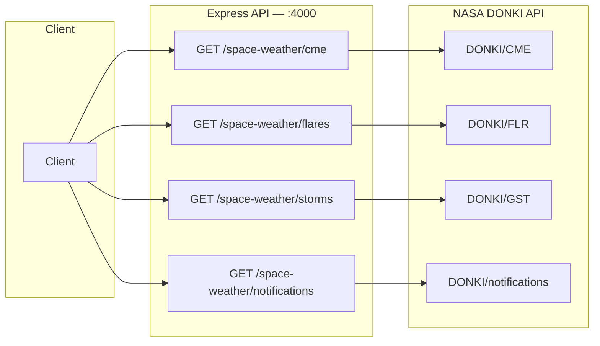
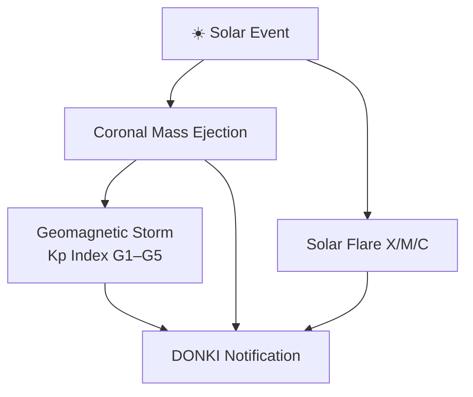

# Space Weather API (DONKI)

> NASA DONKI — Space Weather Database Of Notifications, Knowledge, Information

## Data Flow





## Data Source

`https://api.nasa.gov/DONKI` — requires NASA API key.

---

## Endpoints

### 1. `GET /api/v1/space-weather/cme`

Coronal Mass Ejection events.

**Query Parameters:**

| Parameter | Type | Default | Description |
|-----------|------|---------|-------------|
| `start_date` | string | 30 days ago | YYYY-MM-DD |
| `end_date` | string | today | YYYY-MM-DD |

**Response:**

```json
{
  "success": true,
  "data": {
    "totalCount": 12,
    "dateRange": { "start": "2026-01-01", "end": "2026-01-31" },
    "events": [
      {
        "activityId": "2026-01-15T12:00:00-CME-001",
        "startTime": "2026-01-15T12:00Z",
        "sourceLocation": "N15W30",
        "latitude": 15.0,
        "longitude": -30.0,
        "speed": 800,
        "halfAngle": 45,
        "type": "S",
        "earthDirected": true,
        "estimatedArrival": "2026-01-18T06:00Z",
        "instruments": ["SOHO: LASCO/C2"],
        "linkedEvents": ["2026-01-15T18:00:00-FLR-001"],
        "activeRegionNum": 13542,
        "note": "CME associated with M-class flare",
        "link": "https://kauai.ccmc.gsfc.nasa.gov/DONKI/view/CME/..."
      }
    ]
  }
}
```

> **Fields added**: `latitude`, `longitude` (from best analysis), `linkedEvents` (activity IDs), `activeRegionNum`, `note`, `link`.

---

### 2. `GET /api/v1/space-weather/flares`

Solar flare events with classification.

**Query Parameters:** Same as CME (`start_date`, `end_date`).

**Response includes:** flare classification (X, M, C class), peak time, source location, intensity, and instrument data. Response also contains a `summary` object with counts by class.

---

### 3. `GET /api/v1/space-weather/storms`

Geomagnetic storm events with Kp index.

**Query Parameters:** Same as CME (`start_date`, `end_date`).

**Response:**

```json
{
  "success": true,
  "data": {
    "totalCount": 3,
    "dateRange": { "start": "2026-01-01", "end": "2026-01-31" },
    "events": [
      {
        "stormId": "2026-01-20T00:00:00-GST-001",
        "startTime": "2026-01-20T00:00Z",
        "maxKpIndex": 7,
        "stormLevel": "G3 — Strong",
        "kpReadings": [
          { "observedTime": "2026-01-20T03:00Z", "kpIndex": 7, "source": "NOAA" }
        ]
      }
    ]
  }
}
```

Storm levels: G1 (Minor, Kp=5) → G5 (Extreme, Kp=9).

---

### 4. `GET /api/v1/space-weather/notifications`

Space weather notifications and alerts.

**Query Parameters:**

| Parameter | Type | Default | Description |
|-----------|------|---------|-------------|
| `start_date` | string | 30 days ago | YYYY-MM-DD |
| `end_date` | string | today | YYYY-MM-DD |
| `type` | string | — | Filter by notification type |

**Response:**

```json
{
  "success": true,
  "data": {
    "totalCount": 8,
    "dateRange": { "start": "2026-01-01", "end": "2026-01-31" },
    "notifications": [
      {
        "messageType": "CME",
        "messageId": "20260115-AL-001",
        "messageUrl": "https://kauai.ccmc.gsfc.nasa.gov/...",
        "issueTime": "2026-01-15T14:00Z",
        "body": "## CME Analysis\n..."
      }
    ]
  }
}
```
