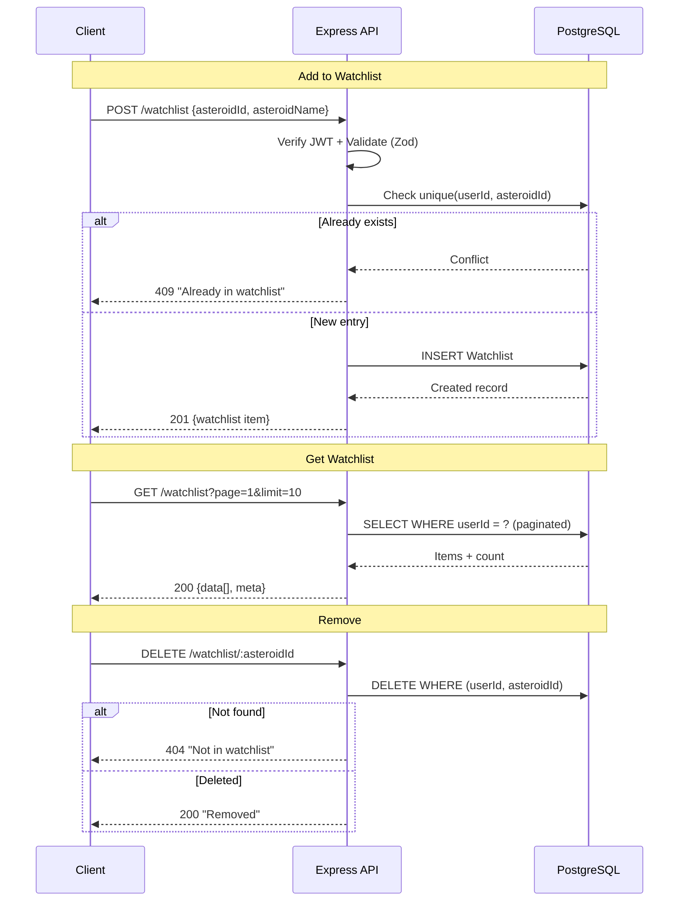

# Watchlist API

> 3 endpoints — Track specific asteroids with custom alert thresholds

## Watchlist Flow



## Endpoints

| # | Method | Endpoint | Auth | Rate Limit |
|---|--------|----------|------|------------|
| 1 | `POST` | `/api/v1/watchlist` | Yes | Global |
| 2 | `GET` | `/api/v1/watchlist` | Yes | Global |
| 3 | `DELETE` | `/api/v1/watchlist/:asteroidId` | Yes | Global |

> **All routes require authentication** — Bearer token in `Authorization` header.

---

## 1. Add to Watchlist

```
POST /api/v1/watchlist
```

Add an asteroid to the authenticated user's watchlist with optional alert configuration.

### Headers

```
Authorization: Bearer <accessToken>
Content-Type: application/json
```

### Request Body

| Field | Type | Required | Default | Validation | Description |
|-------|------|----------|---------|------------|-------------|
| `asteroidId` | string | Yes | — | Min 1 char | NEO reference ID |
| `asteroidName` | string | Yes | — | Min 1 char | Display name |
| `alertOnApproach` | boolean | No | `true` | — | Enable close approach alerts |
| `alertDistanceKm` | number | No | `7500000` | Positive number | Alert threshold in km |

### Example Request

```json
{
  "asteroidId": "2465633",
  "asteroidName": "465633 (2009 JR5)",
  "alertOnApproach": true,
  "alertDistanceKm": 7500000
}
```

### Success Response — `201 Created`

```json
{
  "success": true,
  "message": "Added to watchlist",
  "data": {
    "id": "clx...",
    "userId": "clx...",
    "asteroidId": "2465633",
    "asteroidName": "465633 (2009 JR5)",
    "alertOnApproach": true,
    "alertDistanceKm": 7500000,
    "createdAt": "2026-02-07T10:00:00.000Z",
    "updatedAt": "2026-02-07T10:00:00.000Z"
  }
}
```

### Error Responses

| Status | Condition |
|--------|-----------|
| `400` | Validation failed (missing required fields) |
| `401` | Missing or invalid Bearer token |
| `409` | Asteroid already in user's watchlist |

### Uniqueness Constraint

Each user can add an asteroid only once. The unique constraint is on `(userId, asteroidId)`.

---

## 2. Get Watchlist

```
GET /api/v1/watchlist
```

Retrieve the authenticated user's watchlist with pagination.

### Headers

```
Authorization: Bearer <accessToken>
```

### Query Parameters

| Param | Type | Default | Max | Description |
|-------|------|---------|-----|-------------|
| `page` | number | `1` | — | Page number |
| `limit` | number | `20` | `100` | Items per page |

### Example Request

```
GET /api/v1/watchlist?page=1&limit=10
```

### Success Response — `200 OK`

```json
{
  "success": true,
  "message": "Watchlist retrieved",
  "data": [
    {
      "id": "clx...",
      "userId": "clx...",
      "asteroidId": "2465633",
      "asteroidName": "465633 (2009 JR5)",
      "alertOnApproach": true,
      "alertDistanceKm": 7500000,
      "createdAt": "2026-02-07T10:00:00.000Z",
      "updatedAt": "2026-02-07T10:00:00.000Z"
    }
  ],
  "meta": {
    "page": 1,
    "limit": 10,
    "total": 1,
    "totalPages": 1
  }
}
```

### Sorting

Items are sorted by `createdAt` descending (newest first).

---

## 3. Remove from Watchlist

```
DELETE /api/v1/watchlist/:asteroidId
```

Remove an asteroid from the user's watchlist.

### Headers

```
Authorization: Bearer <accessToken>
```

### Path Parameters

| Param | Type | Description |
|-------|------|-------------|
| `asteroidId` | string | NEO reference ID to remove |

### Example Request

```
DELETE /api/v1/watchlist/2465633
```

### Success Response — `200 OK`

```json
{
  "success": true,
  "message": "Removed from watchlist",
  "data": null
}
```

### Error Responses

| Status | Condition |
|--------|-----------|
| `401` | Missing or invalid Bearer token |
| `404` | Asteroid not in user's watchlist |

---

## Database Schema

```
┌─────────────────────────────────────────────┐
│ Watchlist                                   │
├─────────────────────────────────────────────┤
│ id              UUID      PK, auto-gen      │
│ userId          UUID      FK → User.id       │
│ asteroidId      String    NEO reference ID   │
│ asteroidName    String    Display name       │
│ alertOnApproach Boolean   Default: true      │
│ alertDistanceKm Float     Default: 7500000   │
│ createdAt       DateTime  Auto-set           │
│ updatedAt       DateTime  Auto-update        │
├─────────────────────────────────────────────┤
│ UNIQUE (userId, asteroidId)                 │
└─────────────────────────────────────────────┘
```
