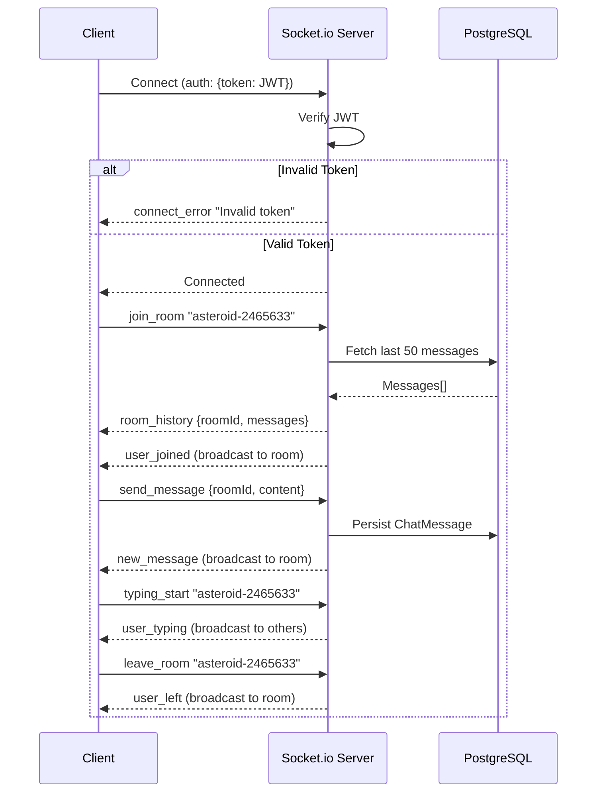
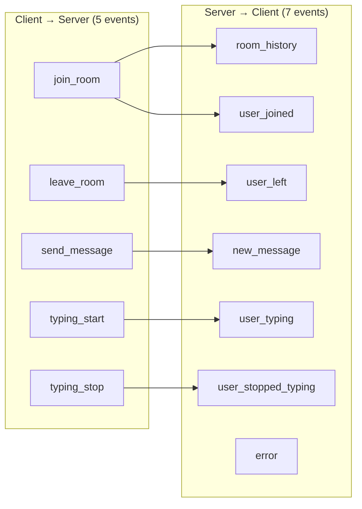

# WebSocket API — Real-Time Chat

> Socket.io-based real-time communication for asteroid discussion rooms

## Connection Flow



## Event Map



## Connection

**URL:** `http://localhost:4000`  
**Transport:** WebSocket (with polling fallback)  
**Protocol:** Socket.io v4

### Authentication

Connections require a valid JWT access token in the handshake:

```javascript
import { io } from 'socket.io-client';

const socket = io('http://localhost:4000', {
  auth: {
    token: '<JWT_ACCESS_TOKEN>'
  }
});

// Or via headers
const socket = io('http://localhost:4000', {
  extraHeaders: {
    authorization: 'Bearer <JWT_ACCESS_TOKEN>'
  }
});
```

### Connection Settings

| Setting | Value |
|---------|-------|
| Ping Timeout | 60,000 ms |
| Ping Interval | 25,000 ms |

---

## Events Overview

### Client → Server (5 events)

| Event | Payload | Description |
|-------|---------|-------------|
| `join_room` | `roomId: string` | Join an asteroid discussion room |
| `leave_room` | `roomId: string` | Leave a room |
| `send_message` | `{ roomId: string, content: string }` | Send a chat message |
| `typing_start` | `roomId: string` | Broadcast typing indicator |
| `typing_stop` | `roomId: string` | Stop typing indicator |

### Server → Client (5 events)

| Event | Payload | Description |
|-------|---------|-------------|
| `room_history` | `{ roomId, messages[] }` | Last 50 messages on join |
| `new_message` | `ChatMessage` | New message in the room |
| `user_joined` | `{ userId, email, timestamp }` | User joined the room |
| `user_left` | `{ userId, email, timestamp }` | User left the room |
| `user_typing` | `{ userId, email }` | User is typing |
| `user_stopped_typing` | `{ userId }` | User stopped typing |
| `error` | `{ message: string }` | Error notification |

---

## Event Details

### `join_room`

Join an asteroid discussion room. Automatically receives the last 50 messages.

```javascript
socket.emit('join_room', 'asteroid-2465633');

socket.on('room_history', ({ roomId, messages }) => {
  console.log(`Room ${roomId}: ${messages.length} messages`);
  messages.forEach(msg => {
    console.log(`${msg.user.name}: ${msg.content}`);
  });
});
```

**Room history message format:**

```json
{
  "roomId": "asteroid-2465633",
  "messages": [
    {
      "id": "clx...",
      "content": "This asteroid is getting closer!",
      "roomId": "asteroid-2465633",
      "createdAt": "2026-02-07T10:00:00.000Z",
      "user": {
        "id": "clx...",
        "name": "John Doe",
        "avatar": null
      }
    }
  ]
}
```

### `send_message`

Send a message to a room. Message is persisted to the database and broadcast to all room members.

```javascript
socket.emit('send_message', {
  roomId: 'asteroid-2465633',
  content: 'This asteroid has a high risk score!'
});

socket.on('new_message', (message) => {
  console.log(`${message.user.name}: ${message.content}`);
});
```

**Validation:**
- Content must not be empty
- Content max length: 1,000 characters
- Messages are trimmed before storage

**Broadcast message format:**

```json
{
  "id": "clx...",
  "content": "This asteroid has a high risk score!",
  "roomId": "asteroid-2465633",
  "userId": "clx...",
  "createdAt": "2026-02-07T10:05:00.000Z",
  "user": {
    "id": "clx...",
    "name": "John Doe",
    "avatar": null
  }
}
```

### `leave_room`

Leave an asteroid discussion room.

```javascript
socket.emit('leave_room', 'asteroid-2465633');
```

### `typing_start` / `typing_stop`

Broadcast typing indicators to other users in the room.

```javascript
// When user starts typing
socket.emit('typing_start', 'asteroid-2465633');

// When user stops typing
socket.emit('typing_stop', 'asteroid-2465633');

// Listen for other users typing
socket.on('user_typing', ({ userId, email }) => {
  console.log(`${email} is typing...`);
});

socket.on('user_stopped_typing', ({ userId }) => {
  // Hide typing indicator
});
```

---

## Room Naming Convention

Rooms are string-based identifiers. Suggested patterns:

| Pattern | Example | Use Case |
|---------|---------|----------|
| `asteroid-{id}` | `asteroid-2465633` | Discuss a specific asteroid |
| `general` | `general` | General community chat |
| `risk-alerts` | `risk-alerts` | Real-time risk discussions |

---

## Error Handling

```javascript
socket.on('error', ({ message }) => {
  console.error('Socket error:', message);
});

socket.on('connect_error', (err) => {
  if (err.message === 'Authentication required') {
    // Redirect to login
  }
  if (err.message === 'Invalid token') {
    // Refresh token and reconnect
  }
});
```

## Database Schema

```
┌───────────────────────────────────────────────┐
│ ChatMessage                                   │
├───────────────────────────────────────────────┤
│ id         UUID      PK, auto-gen             │
│ userId     UUID      FK → User.id              │
│ roomId     String    Room identifier           │
│ content    String    Message text (max 1000)   │
│ createdAt  DateTime  Auto-set                  │
└───────────────────────────────────────────────┘
```
